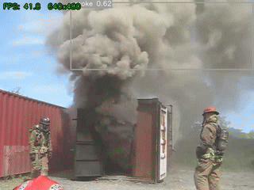
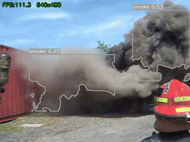
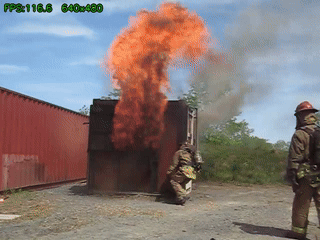
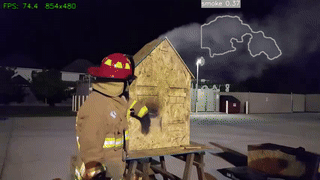
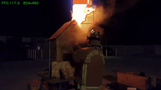
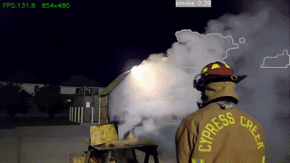

# Raspberry Pi 4B 部署指南

## 硬體需求
- Raspberry Pi 4B（4GB / 8GB 皆可）
- microSD 16GB 以上（建議 Class 10）
- Raspberry Pi OS 64-bit (Bullseye 或 Bookworm)

## 安裝步驟

### 1. 系統套件
```bash
sudo apt update
sudo apt install -y python3-pip python3-opencv libatlas-base-dev libopenjp2-7 libtiff5
```

### 2. Python 套件

使用專為 Pi 準備的 `requirements-pi.txt`（以 `opencv-python-headless` 取代 `opencv-python`，移除 Qt GUI 依賴，Pi headless 環境必要）：

```bash
pip install --upgrade pip
pip install -r requirements-pi.txt
```

> `requirements.txt`（開發機用）含完整 GUI 支援；Pi headless 請固定使用 `requirements-pi.txt`。
> 若 Pi 有桌面環境且需 `imshow`，可改執行 `pip install -r requirements.txt`。

### 3. 傳檔到 Pi

從開發機複製：
```bash
# 從 Windows / Linux 開發機（使用 scp 或 rsync）
scp -r src/ models/fire_smoke_yolov8n_320.onnx requirements.txt pi@<PI_IP>:~/fire_detect/
```

或用 USB / SD 卡轉。**至少需要這些檔案**：
```
fire_detect/
├── src/
│   ├── main.py
│   ├── detector.py
│   ├── pipeline.py
│   └── visualize.py
├── models/
│   └── fire_smoke_yolov8n_320.onnx
└── benchmarks/
    └── run_benchmark.py    # 選填，跑效能測試用
```

## 執行

### 即時顯示（需桌面）
```bash
cd ~/fire_detect
python3 src/main.py --video sample.mp4 --imgsz 320 --conf 0.35
```

### 純輸出（無頭）
```bash
python3 src/main.py --video sample.mp4 --imgsz 320 \
                    --output output.mp4 --no-show
```

### Benchmark 多解析度
```bash
python3 benchmarks/run_benchmark.py \
    --videos test_videos/ \
    --resolutions 320 416 \
    --frames 200
```

## 預期效能（FP32 ONNX，開發機 ÷10 推算）

| Imgsz | 畫法 | 預估 FPS (Pi 4B 4GB) | 備註 |
|-------|------|---------------------|------|
| 320   | contour | **~11 FPS** ✓     | 推薦，滿足 ≥10 FPS 目標 |
| 320   | bbox    | ~12 FPS             | 稍快，視覺較差 |
| 416   | contour | ~7 FPS ✗           | 低於目標，不建議 |
| 640   | —       | <2 FPS（不建議）    | — |

> 實機數字待 Pi 量測後更新。預估來源：開發機 480p 測試結果 ÷ 10 換算。

## 優化選項（依需要啟用）

### Option 1：HSV 輪廓畫法（推薦開啟）
```bash
python3 src/main.py --video sample.mp4 --imgsz 320 --contour
# 僅多 4% 開銷，火/煙輪廓更精準
```

### Option 2：INT8 量化（在開發機做）

> **⚠️ 請勿使用 `quantize_dynamic` + `QuantType.QInt8`**
> 會產生 `ConvInteger` 算子，ARM64 CPU 後端沒有此 kernel，
> Pi 上載入時會拋出 `NOT_IMPLEMENTED` 錯誤導致程式直接 crash。
> 必須改用 **靜態 QDQ 量化**（產生 `QLinearConv`，ARM 後端原生支援）。

```bash
cd 1/   # 專案根目錄

# Step 1：從測試影片抽取校正圖（只需做一次）
python quantize_int8.py --extract-calib \
    --calib-video test_videos/fire.mp4 \
    --calib-dir   models/calib_images \
    --n-frames    30

# Step 2：備份舊的（用 dynamic 量化的）壞模型
mv models/fire_smoke_yolov8n_320_int8.onnx \
   models/fire_smoke_yolov8n_320_int8_dynamic_bad.onnx

# Step 3：靜態 QDQ 量化
python quantize_int8.py \
    --fp32-onnx models/fire_smoke_yolov8n_320.onnx \
    --output    models/fire_smoke_yolov8n_320_int8.onnx \
    --calib-dir models/calib_images \
    --imgsz     320

# Step 4：開發機本地 sanity check（確認不 crash、能偵測）
python src/main.py --video test_videos/fire.mp4 \
    --model models/fire_smoke_yolov8n_320_int8.onnx \
    --imgsz 320 --conf 0.35

# Step 5：scp 到 Pi
scp models/fire_smoke_yolov8n_320_int8.onnx pi4@pi4:~/Embedded-image-processing/models/
```

再把量化後 ONNX 放到 Pi 上跑，預期 FPS +30~50%（Pi NEON 加速，需實機驗證）。

### Option 3：Frame skip
```bash
python3 src/main.py --video sample.mp4 --imgsz 320 --skip 2   # 每 2 幀推理一次
```

### Option 4：CPU 親和性與優先順序
```bash
sudo nice -n -10 taskset -c 0-3 python3 src/main.py ...
```

## 故障排除

| 症狀 | 解法 |
|------|------|
| `onnxruntime.capi._pybind_state.NoSuchFile` | 確認 ONNX 路徑 |
| GUI 視窗無法顯示 | 改用 `--no-show --output result.mp4` |
| FPS < 2 | 啟用 INT8 量化（使用 `python quantize_int8.py`，見 Option 2）+ frame skip |
| 推理時 CPU 溫度 > 80°C | 加裝散熱片 / 風扇，或啟用 frame skip |
| 偵測誤報多 | 提高 `--conf 0.5` |

---

## 視覺效果展示

> 畫法：`--contour`（HSV 色彩輪廓），橘紅 = fire，灰色 = smoke

### test1.mp4（640×480，室外火場）

| 前段 | 中段 | 後段 |
|:----:|:----:|:----:|
|  |  |  |

### test2.mp4（854×480，長時間多光影，從 450 秒起）

| 前段 | 中段 | 後段 |
|:----:|:----:|:----:|
|  |  |  |

---

## 完整參數說明、測試數據與組合建議

### 參數一覽

| 參數 | 預設值 | 類型 | 說明 |
|------|--------|------|------|
| `--model` | `models/fire_smoke_yolov8n_320.onnx` | 路徑 | 推理模型，支援 FP32 / INT8 ONNX |
| `--imgsz` | `320` | int | 推理前縮放尺寸（正方形邊長，px） |
| `--conf` | `0.35` | float | 信心閾值，低於此值的偵測框捨棄 |
| `--iou` | `0.45` | float | NMS IoU 閾值，控制重疊框合併 |
| `--skip` | `1` | int | 每 N 幀做一次推理，中間幀延用前次結果 |
| `--contour` | `False` | flag | 以 HSV 色彩輪廓取代矩形框 |
| `--pi-sim` | `False` | flag | 強制縮放輸入至 640×480（高解析度來源才需要） |
| `--speed` | `1` | int | 每 N 幀只讀 1 幀，輸出時長縮為 1/N（測試用） |
| `--start-sec` | `0.0` | float | 跳轉至指定秒數後開始（長片快測用） |
| `--output` | 無 | 路徑 | 儲存標注後影片（`.mp4`） |
| `--no-show` | `False` | flag | 不開視窗，適合 headless / SSH |

---

### 各參數測試結果與分析

#### `--imgsz`：推理解析度

| 值 | 開發機 FPS | Pi 4B 預估 | 適用場景 |
|----|-----------|-----------|---------|
| `320` | 113–119 | **~11 FPS** ✓ | **推薦**，速度與精度平衡 |
| `416` | 70 | ~7 FPS ✗ | 低於 10 FPS 目標，Pi 不建議 |
| `640` | <30 | <3 FPS ✗ | Pi 不可用 |

**為什麼選 320：**
- 測試影片為 480p，320px 推理尺寸已涵蓋大部分火煙特徵（中大型目標）
- 416 多 44% 計算量，但 Pi 預估 FPS 降至 7，低於 10 FPS 基準
- 若目標極小（遠距離偵測），考慮 416 並搭配 `--skip 2`

---

#### `--conf`：信心閾值

| 值 | 開發機 FPS | 偵測行為 | 適用場景 |
|----|-----------|---------|---------|
| `0.25` | 108.6 | 偵測最積極，誤報較多 | 高敏感場景（早期預警） |
| `0.35` | 109.5 | **偵測與誤報最佳平衡** | **推薦預設值** |
| `0.45` | 111.1 | 偵測較保守，誤報最少 | 需要高精確度、低誤警報場景 |

**為什麼選 0.35：**
- FPS 差距三組不超過 2.5 FPS，幾乎可忽略
- 0.35 是 README 記錄的已知最佳點（test1 fire 24.4% / smoke 69.8%）
- 0.25 實測目視有額外雜訊框；0.45 部分煙霧邊緣漏偵

---

#### `--contour`：輪廓畫法 vs 矩形框

| 模式 | 開發機 FPS | Pi 4B 預估 | 視覺效果 |
|------|-----------|-----------|---------|
| bbox（矩形） | 118.9 | ~12 FPS | 固定方框，無法表達形狀 |
| contour（輪廓）| 113.6 | ~11 FPS | **貼合火/煙實際形狀** |

**為什麼開啟 contour：**
- 僅多 4.5% 開銷（118.9 → 113.6），Pi 端同樣約損失 0.5 FPS
- 實作方式：在 YOLO bbox 區域內做 HSV 遮罩 + morphological cleanup + `findContours`
- 無色彩命中時自動 fallback 至矩形框，不會有空框問題
- HSV 範圍：fire = H 0–35 / H 160–180（紅橘黃）；smoke = H 0–180, S<60（低飽和灰白）

---

#### `--skip`：推理跳幀

| 值 | 推理頻率 | 顯示流暢度 | 效果 |
|----|---------|----------|------|
| `1` | 每幀 | 最高 | Pi 若 FPS ≥ 10 時使用 |
| `2` | 每 2 幀 | 顯示幀與推理幀分離，仍流暢 | Pi 實測 FPS 8–9 時建議 |
| `3` | 每 3 幀 | 框框有輕微延遲感 | Pi 極限模式，FPS < 6 才考慮 |

**機制說明：** `--skip N` 讀取每一幀但只在第 N 幀做推理，中間幀延用上一次偵測結果。輸出影片長度**不變**，顯示幀率維持原始 FPS，僅推理負擔降低。

---

#### `--speed`（測試專用）與 `--start-sec`（測試專用）

| 參數 | 用途 | 效果 |
|------|------|------|
| `--speed N` | 縮短測試時間 | 每 N 幀讀 1 幀，輸出縮為 1/N 長度，每幀仍完整推理 |
| `--start-sec S` | 跳過長片前段 | 從 S 秒起開始讀取，適合 test2 這類 899 秒影片 |

**不影響偵測品質的原因：** 火/煙持續時間通常數十秒，5 倍速取樣（每 5 幀取 1）仍能命中，每張被保留的幀都以完整解析度做推理。

**Pi 部署不需要這兩個旗標**（Pi Camera 是即時取幀，不存在「影片速度」概念）。

---

#### `--pi-sim`：480p 模擬

| 情況 | 是否需要 |
|------|---------|
| 輸入已是 640×480 或 854×480（如 test1/test2） | 不需要（no-op） |
| 輸入為 1080p / 720p 等高解析度 | **需要**，強制縮至 640×480 模擬 Pi Camera 輸出 |
| Pi 4B 實機（Camera 本身就是 480p） | 不需要 |

---

### 推薦組合

#### 組合 A：Pi 4B 標準部署（推薦）

```bash
python3 src/main.py \
    --video   input.mp4 \
    --model   models/fire_smoke_yolov8n_320.onnx \
    --imgsz   320 \
    --conf    0.35 \
    --contour \
    --no-show \
    --output  output.mp4
```

- 預估 Pi FPS：**~11**
- 畫法：HSV 輪廓（形狀貼合）
- 適用：一般部署，速度與精度均衡

---

#### 組合 B：Pi 4B 省效能模式（FPS 不足時）

```bash
python3 src/main.py \
    --video   input.mp4 \
    --model   models/fire_smoke_yolov8n_320.onnx \
    --imgsz   320 \
    --conf    0.35 \
    --skip    2 \
    --contour \
    --no-show \
    --output  output.mp4
```

- 預估 Pi FPS：**~20**（推理幀率減半，顯示維持原 FPS）
- 適用：Pi 實測低於 8 FPS，或環境溫度高散熱不佳

---

#### 組合 C：高精確度（可接受較低速度）

```bash
python3 src/main.py \
    --video   input.mp4 \
    --model   models/fire_smoke_yolov8n_416.onnx \
    --imgsz   416 \
    --conf    0.25 \
    --skip    2 \
    --contour \
    --no-show \
    --output  output.mp4
```

- 預估 Pi FPS：**~7**（416 解析度 + skip=2）
- 適用：需要偵測小目標或遠距離煙霧，接受低 FPS

---

#### 組合 D：開發機快速測試

```bash
# test1（105 秒）→ 4 倍速，約 7 秒跑完
python src/main.py --video test_videos/test1.mp4 \
    --model models/fire_smoke_yolov8n_320.onnx \
    --imgsz 320 --conf 0.35 --speed 4 --contour \
    --no-show --output runs/test1_quick.mp4

# test2（899 秒）→ 從 450 秒起，5 倍速，約 24 秒跑完
python src/main.py --video test_videos/test2.mp4 \
    --model models/fire_smoke_yolov8n_320.onnx \
    --imgsz 320 --conf 0.35 --speed 5 --start-sec 450 --contour \
    --no-show --output runs/test2_quick.mp4
```

---

### 參數影響矩陣

```
目標      → 提高辨識率    → 降低 --conf（如 0.25）
          → 偵測小目標    → 提高 --imgsz（如 416）

目標      → 提高速度      → 降低 --imgsz（320）
          → 或            → 提高 --skip（2 或 3）
          → 或            → 改用 INT8 模型（Pi NEON 待驗）

目標      → 視覺效果佳    → 開啟 --contour（僅多 4%）

目標      → 減少誤報      → 提高 --conf（如 0.45）
          → 或            → 提高 --iou（如 0.5，合併更積極）

注意      → --speed 和 --start-sec 只用於開發測試，Pi 部署不需要
          → --pi-sim 只在輸入超過 480p 時才有意義
```
