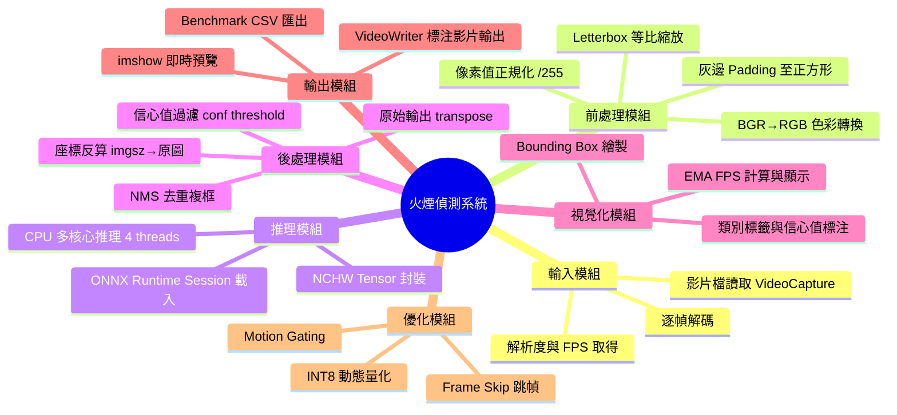
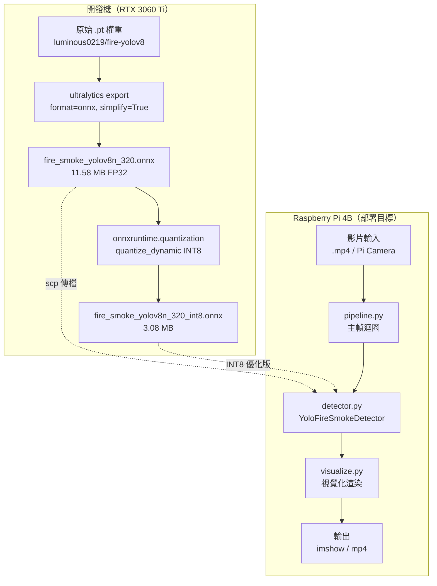

# 影片火煙偵測系統 (Video Fire & Smoke Detection)

> 嵌入式影像處理作業 — 目標平台：Raspberry Pi 4B

---

## 目錄

1. [專案簡介](#一專案簡介)
2. [功能分解圖 BREAKDOWN](#二功能分解圖-breakdown)
3. [系統架構圖](#三系統架構圖)
4. [處理流程圖](#四處理流程圖)
5. [實驗設計](#五實驗設計)
6. [安裝與使用](#六安裝與使用)
7. [案例效果展示](#七案例效果展示)
8. [效能 Benchmark](#八效能-benchmark)
9. [目前進度](#九目前進度)

---

## 一、專案簡介

本專案旨在開發一套可於 **Raspberry Pi 4B** 上即時運行的影像火煙偵測系統。透過 **YOLOv8n** 預訓練模型與 **ONNX Runtime CPU** 推理引擎，系統能在受限的嵌入式硬體上，對影片逐幀偵測火焰（Fire）與濃煙（Smoke），並以 **Bounding Box** 標示偵測區域與信心值。

### 核心需求

| 需求 | 說明 |
|------|------|
| 火焰偵測 | 偵測畫面中出現的明火 |
| 濃煙偵測 | 偵測濃密煙霧區域 |
| 位置標示 | 即時繪製 Bounding Box + 類別標籤 |
| 效能量測 | 顯示 FPS 與解析度資訊 |
| 嵌入式部署 | 可在 Pi 4B（無 GPU）上穩定運行 |

### 技術選型理由

- **不從頭訓練**：使用既有火煙預訓練權重（mAP@0.5 ≈ 81.2%），避免建置大量 dataset
- **ONNX Runtime**：比完整 PyTorch/TF 輕量，ARM 上安裝簡便
- **YOLOv8n**：nano 版本體積小（~12 MB ONNX），兼顧準確率與速度

---

## 二、功能分解圖 BREAKDOWN



---

## 三、系統架構圖



### 模組職責

| 模組 | 檔案 | 職責 |
|------|------|------|
| 偵測器 | `src/detector.py` | 封裝 ONNX 推理、letterbox 前處理、NMS 後處理 |
| 主迴圈 | `src/pipeline.py` | VideoCapture 幀迴圈、EMA FPS 計算、VideoWriter |
| 視覺化 | `src/visualize.py` | Bounding Box 繪製、FPS overlay |
| 入口 | `src/main.py` | CLI argparse、整合各模組 |
| 效能測試 | `benchmarks/run_benchmark.py` | 多解析度 latency/FPS 量測 |

---

## 四、處理流程圖


### 關鍵資料契約

```
ONNX 輸出格式（imgsz=320, nc=2）：
  shape: [1, 6, 2100]
  axis-1: [cx, cy, w, h, p_fire, p_smoke]   ← pixel space (0~320)
  axis-2: 2100 個候選框 (40×40 + 20×20 + 10×10 anchors)
```

---

## 五、實驗設計

### 5.1 研究問題

1. YOLOv8n 火煙預訓練模型在真實火場影片上的偵測率為何？
2. 不同解析度（320 / 416 / 640）對 FPS 與準確率的影響？
3. INT8 量化在 ARM 平台上的速度收益？

### 5.2 實驗變數

| 類型 | 變數 |
|------|------|
| 自變數 | 推理解析度（imgsz）、量化精度（FP32 / INT8）、frame skip 數 |
| 應變數 | 平均 FPS、推理延遲 ms、偵測率（%）、信心值分布 |
| 控制變數 | 模型權重、conf threshold（0.35）、IoU threshold（0.45） |

### 5.3 測試資料集

| 影片 | 解析度 | 時長 | 場景特性 |
|------|--------|------|----------|
| test1.mp4 | 640×480 | 105 秒 | 火焰＋濃煙並存，室外場景 |
| test2.mp4 | 854×480 | 899 秒 | 長時間監控，多光影條件 |

### 5.4 評估指標

- **偵測率**：有偵測到 fire/smoke 的幀數佔比
- **最高信心值**：量測模型對目標的最大確信度
- **平均 FPS**：`total_frames / total_inference_time`
- **p99 latency**：99th percentile 單幀推理時間（ms）

---

## 六、安裝與使用

### 環境需求

```
Python >= 3.8
onnxruntime >= 1.16.0
opencv-python >= 4.8.0
numpy >= 1.24.0
```

### 安裝

```bash
pip install -r requirements.txt
```

### 偵測影片（顯示視窗）

```bash
python src/main.py \
    --video  test_videos/fire.mp4 \
    --model  models/fire_smoke_yolov8n_320.onnx \
    --imgsz  320 \
    --conf   0.35
```

### 無頭輸出（Pi / SSH 環境）

```bash
python src/main.py \
    --video  test_videos/fire.mp4 \
    --model  models/fire_smoke_yolov8n_320.onnx \
    --output output.mp4 \
    --no-show
```

### 參數說明

| 參數 | 預設值 | 說明 |
|------|--------|------|
| `--video` | 必填 | 輸入影片路徑 |
| `--model` | models/fire_smoke_yolov8n_320.onnx | ONNX 模型路徑 |
| `--imgsz` | 320 | 推理解析度（正方形邊長） |
| `--conf`  | 0.35 | 信心閾值，越高越嚴格 |
| `--iou`   | 0.45 | NMS IoU 閾值 |
| `--skip`  | 1 | 每 N 幀推理一次（省效能） |
| `--output` | 無 | 輸出標注影片路徑 |
| `--no-show` | False | 不顯示視窗（headless） |

### 效能 Benchmark

```bash
python benchmarks/run_benchmark.py \
    --videos test_videos/ \
    --resolutions 320 416 640 \
    --frames 300
```

---

## 七、案例效果展示

### 真實火場影片偵測結果


> 橘紅色框 = **fire（火焰）**　灰色框 = **smoke（濃煙）**　左上角顯示即時 FPS

### 案例量化結果

#### Case 1：test1.mp4（640×480，105 秒，室外火場）

| 指標 | 數值 |
|------|------|
| 推理解析度 | 320×320 |
| 平均 FPS（開發機） | **124.6** |
| Fire 偵測率 | **24.4%**（770 / 3161 幀） |
| Smoke 偵測率 | **69.8%**（2205 / 3161 幀） |
| Fire 最高信心值 | 0.863 |
| Smoke 最高信心值 | **0.916** |

#### Case 2：test2.mp4（854×480，899 秒，長時間多光影）

| 指標 | 數值 |
|------|------|
| 推理解析度 | 320×320 |
| 總幀數 | 26,913 幀 |
| Fire 偵測率（抽樣） | **26.8%** |
| Smoke 偵測率（抽樣） | **27.3%** |
| Fire 最高信心值 | 0.873 |
| Smoke 最高信心值 | 0.839 |

### 信心值分析

- 兩段影片的最高信心值均 > 0.80，顯示模型對目標具高確信度
- Smoke 偵測率在 test1（69.8%）高於 test2（27.3%），反映不同場景的煙霧密度差異

---

## 八、效能 Benchmark

### 開發機結果（RTX 3060 Ti，CPU-only 推理）

| 模型版本 | Imgsz | FPS | ms/frame |
|----------|-------|-----|---------|
| FP32 ONNX | 320 | 124.6 | 8.0 |
| INT8 ONNX | 320 | 8.5* | 117.4 |

*INT8 在 x86 上因 dequantization overhead 反而較慢；ARM Pi 4B 需實機驗證

### Pi 4B 預估（待實機量測）

| 模型版本 | Imgsz | 預估 FPS | 備註 |
|----------|-------|---------|------|
| FP32 | 320 | 4–8 | ONNX Runtime ARM |
| INT8 | 320 | 6–12 | ARM NEON INT8 加速 |
| FP32 + skip=2 | 320 | 8–16 | 每 2 幀推理 |

### 模型大小比較

| 格式 | 大小 | 縮減比 |
|------|------|--------|
| .pt（PyTorch） | 5.97 MB | — |
| ONNX FP32 | 11.58 MB | — |
| ONNX INT8 | **3.08 MB** | **73%** ↓ |

---

## 九、目前進度

- [x] 需求定義
- [x] 預訓練模型取得（YOLOv8n，mAP@0.5 ≈ 81.2%）
- [x] ONNX 匯出（320 / 416）
- [x] INT8 量化（FP32 11.58MB → 3.08MB）
- [x] 偵測 pipeline 實作（前處理 / 推理 / NMS / 視覺化 / FPS）
- [x] 端對端測試通過（開發機 124 FPS）
- [x] 真實火煙影片驗證（2 段，偵測率 24–70%，最高信心 0.916）
- [ ] Raspberry Pi 4B 實機 benchmark
- [ ] INT8 量化 Pi 實機加速驗證
- [ ] 不同光影條件壓力測試

---

## 授權

模型權重：[luminous0219/fire-and-smoke-detection-yolov8](https://github.com/luminous0219/fire-and-smoke-detection-yolov8)（AGPL-3.0）

程式碼：本 repo 依作業需求自行開發
