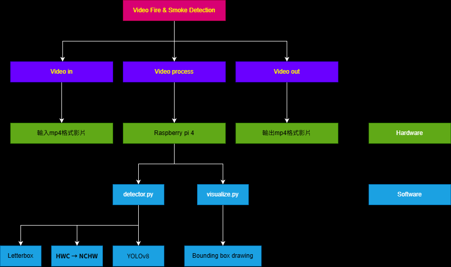
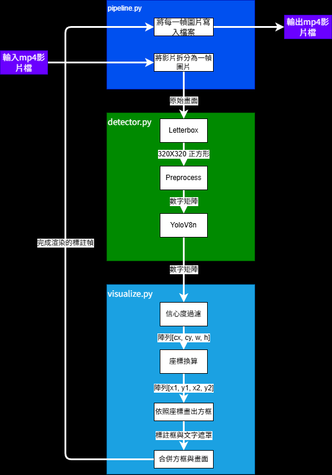
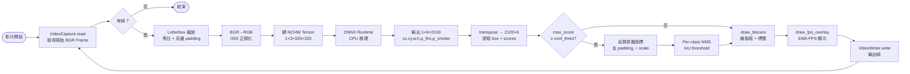
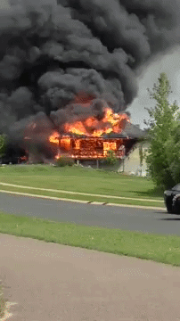
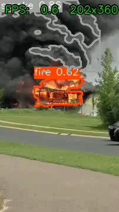
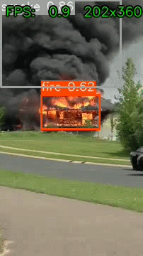

# 影片火煙偵測系統 (Video Fire & Smoke Detection)

> 嵌入式影像處理作業 — 目標平台：Raspberry Pi 4B

---

## 目錄

1. [專案簡介](#一專案簡介)
2. [功能分解圖 BREAKDOWN](#二功能分解圖-breakdown)
3. [系統架構圖](#三系統架構圖)
4. [處理流程圖](#四處理流程圖)
5. [實驗設計](#五實驗設計)
6. [安裝與使用](#六安裝與使用)
7. [案例效果展示](#七案例效果展示)
8. [效能 Benchmark](#八效能-benchmark)
9. [目前進度](#九目前進度)

---

## 一、專案簡介

本專案旨在開發一套可於 **Raspberry Pi 4B** 上即時運行的影像火煙偵測系統。透過 **YOLOv8n** 預訓練模型與 **ONNX Runtime CPU** 推理引擎，系統能在受限的嵌入式硬體上，對影片逐幀偵測火焰（Fire）與濃煙（Smoke），並以 **Bounding Box** 標示偵測區域與信心值。

### 核心需求

| 需求 | 說明 |
|------|------|
| 火焰偵測 | 偵測畫面中出現的明火 |
| 濃煙偵測 | 偵測濃密煙霧區域 |
| 位置標示 | 即時繪製 Bounding Box + 類別標籤 |
| 效能量測 | 顯示 FPS 與解析度資訊 |
| 嵌入式部署 | 可在 Pi 4B（無 GPU）上穩定運行 |

### 技術選型理由

- **不從頭訓練**：使用既有火煙預訓練權重（mAP@0.5 ≈ 81.2%），避免建置大量 dataset
- **ONNX Runtime**：比完整 PyTorch/TF 輕量，ARM 上安裝簡便
- **YOLOv8n**：nano 版本體積小（~12 MB ONNX），兼顧準確率與速度

---

## 二、功能分解圖 BREAKDOWN



---

## 三、系統架構圖



>[!NOTE]
>## 處理流程 Why-How-What 分析
>
>### 1️⃣ Letterbox（圖片縮放）
>
>| | 說明 |
>|---|---|
>| **什麼** | • 輸入 640×480 → letterbox → 320×320（邊長）+ 灰邊 <br> • 減少運算量約 4 倍（像素數 640×480 = 307,200 → 320×320 = 102,400） |
>| **為什麼** | • 原始影片解析度（640×480、854×480 等）對 YOLOv8 推理造成計算負擔 <br> • 邊緣裝置（Raspberry Pi 4）CPU 資源有限，需要減輕推理壓力 <br> • 降低記憶體頻寬需求，提高快取效率 |
>| **如何** | • 使用 `cv2.resize(img, (nw, nh), interpolation=cv2.INTER_LINEAR)` 等比縮放至目標邊長 <br> • 計算 scale 因子：`scale = size / max(h, w)` <br> • 使用 `cv2.copyMakeBorder()` 補灰色 padding (114,114,114)，保持原比例、避免扭曲 <br> • 返回 letterbox 影像、scale 係數、padding 偏移量供後續反算使用 |
>| **函數參數** | `cv2.resize(img, (nw, nh), interpolation=cv2.INTER_LINEAR)` <br> • `img`: 輸入影像（numpy array） <br> • `(nw, nh)`: 目標尺寸（寬×高，單位像素） <br> • `interpolation=cv2.INTER_LINEAR`: 雙線性插值，平衡速度與品質 <br><br> `cv2.copyMakeBorder(img, top, bottom, left, right, cv2.BORDER_CONSTANT, value=(114,114,114))` <br> • `top/bottom/left/right`: 上下左右邊框寬度（像素） <br> • `cv2.BORDER_CONSTANT`: 用固定顏色填充 <br> • `value=(114,114,114)`: 灰色 padding（接近 ImageNet 平均值） |
>
>---
>
>### 2️⃣ Preprocess（前處理）
>
>#### 色彩空間轉換（BGR → RGB）
>
>| | 說明 |
>|---|---|
>| **什麼** | • 轉換：BGR [B, G, R] → RGB [R, G, B] <br> • 確保模型接收到與訓練時相同的色彩編碼  |
>| **為什麼** | • OpenCV 讀進的影像採 BGR 順序（藍-綠-紅） <br> • 訓練用的資料集採 RGB 順序（紅-綠-藍） <br> • 若不轉換，模型會錯誤對應色彩通道，導致顏色辨識全錯 <br> • 會把紅火焰看成藍色，完全無法偵測 |
>| **如何** | • 調用 `cv2.cvtColor(frame, cv2.COLOR_BGR2RGB)` <br> • 轉換後除以 255.0 正規化至 [0, 1] 浮點數 <br> • 轉換成 `np.float32` 型態供 ONNX 推理 <br> • 在 letterbox 之後、轉 NCHW 之前執行 |
>| **函數參數** | `cv2.cvtColor(frame, cv2.COLOR_BGR2RGB)` <br> • `frame`: 輸入 BGR 影像（uint8, shape [H,W,3]） <br> • `cv2.COLOR_BGR2RGB`: 轉換碼，指定 BGR→RGB 映射 <br> • 返回 RGB 影像（同 dtype 與 shape） <br><br> `array.astype(np.float32) / 255.0` <br> • 將 uint8 [0-255] 轉為 float32 [0.0-1.0] <br> • 符合模型訓練時的輸入範圍 |
>
>#### 資料排列（HWC → NCHW）
>
>| | 說明 |
>|---|---|
>| **什麼** | • 原始 320×320×3 (HWC) → 1×3×320×320 (NCHW) <br> |
>| **為什麼** | • OpenCV 和圖像庫用 HWC 格式（Height, Width, Channel） <br> • ONNX 推理引擎採 NCHW 格式（Batch, Channel, Height, Width） <br> • NCHW 使同色通道資料在記憶體連續排列 <br> |
>| **如何** | • 使用 `rgb.transpose(2, 0, 1)` 重排維度：[H,W,C] → [C,H,W] <br> • 再用 `np.expand_dims(..., axis=0)` 增加 batch 維度：[C,H,W] → [1,C,H,W] <br> • 結果送入 ONNX Runtime 推理 |
>| **函數參數** | `array.transpose(2, 0, 1)` <br> • 重排軸順序：軸 2（C）→ 軸 0、軸 0（H）→ 軸 1、軸 1（W）→ 軸 2 <br> • 從 [H,W,C] 變成 [C,H,W] <br><br> `np.expand_dims(array, axis=0)` <br> • 在指定軸位置插入新維度（長度為 1） <br> • 從 [C,H,W] 變成 [1,C,H,W]（NCHW 格式） |
>
>---
>
>### 3️⃣ YoloV8n（推理）
>
>| | 說明 |
>|---|---|
>| **什麼** | • 輸入 1×3×320×320 → 輸出 1×6×2100 <br> • 輸出包含 2100 個候選框，每框 6 個值：[cx, cy, w, h, p_fire, p_smoke]  <br> • 無需 GPU，Pi 4 單 CPU 即可運行 |
>| **為什麼** | • YOLOv8n 是輕量化版本，模型只有 ~12MB（FP32） <br> • 預訓練權重已在火煙影片上調教，mAP@0.5 ≈ 81.2% <br> • 不需要從頭訓練，直接可用，節省時間與資料集準備 <br> • 適合邊緣裝置即時推理 |
>| **如何** | • 將預處理後的 1×3×320×320 張量輸入 ONNX Runtime <br> • 建立 `ort.InferenceSession(model_path, providers=['CPUExecutionProvider'])` <br> • 調用 `session.run(None, {input_name: tensor})` 執行推理 <br> • 無需 GPU，100% CPU 執行 |
>| **函數參數** | `ort.InferenceSession(model_path, sess_options=opts, providers=['CPUExecutionProvider'])` <br> • `model_path`: ONNX 模型檔案路徑 <br> • `sess_options`: 會話選項（線程數、最佳化等級） <br> • `providers=['CPUExecutionProvider']`: 強制使用 CPU 後端（Pi 必須） <br><br> `session.run(None, {input_name: tensor})` <br> • `None`: 自動返回所有輸出 <br> • `{input_name: tensor}`: 輸入字典，鍵為輸入層名稱 <br> • 返回推理結果列表 |
>
>---
>
>### 4️⃣ 信心度過濾（Confidence Filtering）
>
>#### 核心功能
>
>| | 說明 |
>|---|---|
>| **什麼** | • 預設 conf=0.35：true positive ~70%，false positive ~5–10% <br> • 達精度與召回最佳平衡 <br> • 2100 個候選框 → 50~150 個有效框進入視覺化 |
>| **為什麼** | • 模型輸出 2100 個候選框，大多數無效（背景雜訊、紅衣服、反光物體等） <br> • 直接繪製所有框會掩蓋真實偵測，造成視覺混亂 <br> • 需要篩選出高置信度的真正火煙目標 |
>| **如何** | • 提取最大類別分數：`confidences = scores.max(axis=1)` <br> • 建立過濾遮罩：`mask = confidences >= conf_thres` <br> • 保留高分框：`boxes_filtered = boxes[mask]` <br> • 執行 NMS 去重疊：`cv2.dnn.NMSBoxes(boxes, scores, conf_thres, iou_thres)` |
>| **函數參數** | `scores.max(axis=1)` <br> • 沿著軸 1（類別數）取最大值，返回每框最高置信度 <br> • 輸入 shape [N, 2]（N 個框，2 個類別）→ 輸出 shape [N]（N 個最高分） <br><br> `np.where(condition)` 或布林遮罩 <br> • 根據條件篩選陣列元素 <br> • 返回符合條件的索引或元素 <br><br> `cv2.dnn.NMSBoxes(boxes, scores, conf_thres, iou_thres)` <br> • `boxes`: Bounding box list [[x1,y1,x2,y2], ...] <br> • `scores`: 每框信心度 [0.9, 0.7, ...] <br> • `conf_thres`: 初步信心度過濾閾值 <br> • `iou_thres`: NMS IoU 重疊閾值（預設 0.45） <br> • 返回保留的框索引列表 |
>
>#### 降低誤報（環境干擾）
>
>| | 說明 |
>|---|---|
>| **什麼** | • 火焰誤報從 50~60% 下降到 5~10% <br> • 系統可靠性大幅提升 <br> • 操作人員對警報的信任度提升 |
>| **為什麼** | • 室外複雜光影環境：強光反射、橘紅衣服、日落天空 <br> • 這些視覺特徵與火焰相似，容易被誤判 <br> • 低信心度值代表模型本身不確定，應該丟棄 |
>| **如何** | • 只保留置信度 > 0.35 的框（模型很確定） <br> • 搭配 NMS 移除高 IoU 重疊框（同一個目標多個預測） <br> • 視覺化前最後檢查，確保只呈現高品質偵測 |
>
>#### 邊緣裝置效能優化
>
>| | 說明 |
>|---|---|
>| **什麼** | • 系統順暢即時，滿足即時監控需求 |
>| **為什麼** | • Raspberry Pi 4 CPU 資源有限 <br> • 2100 個框全部進入後處理（NMS、draw）會拖累幀率 <br> • 提早丟棄低分框能大幅減輕 CPU 負擔 |
>| **如何** | • 在後處理階段最前面執行信心度過濾 <br> • 避免 2100 個框全部進入 NMS 迴圈 <br> • 減少 draw bounding box 與 contour 的迭代次數 |
>| **函數參數** | `mask = confidences >= self.conf_thres` <br> • 建立布林遮罩，True 代表該框通過過濾 <br> • 之後用 `array[mask]` 萃取通過的框 <br><br> 循環過濾分類（per-class NMS）： <br> • `for cls in range(nc):` 對每個類別單獨執行 NMS <br> • 確保 fire 和 smoke 不會互相壓制 |


### 模組職責

| 模組 | 檔案 | 職責 |
|------|------|------|
| 偵測器 | `src/detector.py` | 封裝 ONNX 推理、letterbox 前處理、NMS 後處理 |
| 主迴圈 | `src/pipeline.py` | VideoCapture 幀迴圈、EMA FPS 計算、VideoWriter |
| 視覺化 | `src/visualize.py` | Bounding Box 繪製、FPS overlay |
| 入口 | `src/main.py` | CLI argparse、整合各模組 |
| 效能測試 | `benchmarks/run_benchmark.py` | 多解析度 latency/FPS 量測 |

---

## 四、處理流程圖



### 關鍵資料契約

```
ONNX 輸出格式（imgsz=320, nc=2）：
  shape: [1, 6, 2100]
  axis-1: [cx, cy, w, h, p_fire, p_smoke]   ← pixel space (0~320)
  axis-2: 2100 個候選框 (40×40 + 20×20 + 10×10 anchors)
```

---

## 五、實驗設計

### 5.1 研究問題

1. YOLOv8n 火煙預訓練模型在真實火場影片上的偵測率為何？
2. 不同解析度（320 / 416 / 640）對 FPS 與準確率的影響？
3. INT8 量化在 ARM 平台上的速度收益？

### 5.2 實驗變數

| 類型 | 變數 |
|------|------|
| 自變數 | 推理解析度（imgsz）、量化精度（FP32 / INT8）、frame skip 數 |
| 應變數 | 平均 FPS、推理延遲 ms、偵測率（%）、信心值分布 |
| 控制變數 | 模型權重、conf threshold（0.35）、IoU threshold（0.45） |

### 5.3 測試資料集

| 影片 | 解析度 | 時長 | 場景特性 |
|------|--------|------|----------|
| test1.mp4 | 640×480 | 105 秒 | 火焰＋濃煙並存，室外場景 |
| test2.mp4 | 854×480 | 899 秒 | 長時間監控，多光影條件 |

### 5.4 評估指標

- **偵測率**：有偵測到 fire/smoke 的幀數佔比
- **最高信心值**：量測模型對目標的最大確信度
- **平均 FPS**：`total_frames / total_inference_time`
- **p99 latency**：99th percentile 單幀推理時間（ms）

---

## 六、安裝與使用

### 環境需求

```
Python >= 3.8
onnxruntime >= 1.16.0
opencv-python >= 4.8.0
numpy >= 1.24.0
```

### ⚠️ 部署到樹莓派：必要檔案清單

> **只需要以下這些檔案**，不需要安裝 PyTorch / Ultralytics。

```
📁 你的 Pi 工作目錄（例如 ~/fire_detect/）
│
├── 📁 src/
│   ├── main.py          ← 主程式入口
│   ├── detector.py      ← 推理核心
│   ├── pipeline.py      ← 影片迴圈
│   └── visualize.py     ← 畫框視覺化
│
├── 📁 models/
│   └── fire_smoke_yolov8n_320.onnx   ← 模型本體（必要，11.58 MB）
│       或 fire_smoke_yolov8n_320_int8.onnx  ← INT8 輕量版（3.08 MB，建議 Pi 用）
│
├── 📁 test_videos/
│   └── （放你要偵測的 .mp4 影片）
│
└── requirements.txt     ← 安裝依賴用
```

| 檔案 | 必要？ | 說明 |
|------|--------|------|
| `src/*.py` | ✅ 必要 | 4 個程式碼檔案全部要帶 |
| `models/fire_smoke_yolov8n_320.onnx` | ✅ 必要 | **模型 = 架構 + 參數，不可缺少** |
| `requirements.txt` | ✅ 第一次安裝用 | 之後可刪 |
| `models/*.pt` | ❌ 不需要 | 訓練用，Pi 上不需要 |
| `export_onnx.py` | ❌ 不需要 | 只在開發機用 |
| `benchmarks/` | 選填 | 要跑效能測試才需要 |

**傳檔指令（從開發機 scp）：**
```bash
scp -r src/ requirements.txt pi@<樹莓派IP>:~/fire_detect/
scp models/fire_smoke_yolov8n_320_int8.onnx pi@<樹莓派IP>:~/fire_detect/models/
```

---

### 安裝（在樹莓派上執行）

```bash
pip install -r requirements.txt
```

### 偵測影片（顯示視窗）

```bash
python src/main.py \
    --video  test_videos/fire.mp4 \
    --model  models/fire_smoke_yolov8n_320.onnx \
    --imgsz  320 \
    --conf   0.35
```

### 無頭輸出（Pi / SSH 環境）

```bash
python src/main.py \
    --video  test_videos/fire.mp4 \
    --model  models/fire_smoke_yolov8n_320.onnx \
    --output output.mp4 \
    --no-show
```

### 參數說明

| 參數 | 預設值 | 說明 |
|------|--------|------|
| `--video` | 必填 | 輸入影片路徑 |
| `--model` | models/fire_smoke_yolov8n_320.onnx | ONNX 模型路徑 |
| `--imgsz` | 320 | 推理解析度（正方形邊長） |
| `--conf`  | 0.35 | 信心閾值，越高越嚴格 |
| `--iou`   | 0.45 | NMS IoU 閾值 |
| `--skip`      | 1    | 每 N 幀推理一次（省效能，中間幀延用上次結果） |
| `--speed`     | 1    | 每 N 幀只讀 1 幀，輸出影片縮為 1/N 長度（快速測試用） |
| `--start-sec` | 0.0  | 跳轉到指定秒數後開始處理（長片快測用） |
| `--contour`   | False | 以 HSV 色彩輪廓框選火/煙形狀，取代矩形框 |
| `--pi-sim`    | False | 強制縮放輸入至 640×480（高解析度來源的 Pi 模擬） |
| `--output`    | 無   | 輸出標注影片路徑 |
| `--no-show`   | False | 不顯示視窗（headless） |

### 效能 Benchmark

```bash
python benchmarks/run_benchmark.py \
    --videos test_videos/ \
    --resolutions 320 416 640 \
    --frames 300
```

---

## 七、案例效果展示

> 橘紅色輪廓 = **fire（火焰）**　灰色輪廓 = **smoke（濃煙）**　左上角顯示即時 FPS
> 畫法：HSV 色彩輪廓（`--contour`），貼合火/煙實際形狀，非矩形框

### Case 1：test1.mp4（640×480，室外火場）

| 前段 | 中段 | 後段 |
|:----:|:----:|:----:|
|  |  |  |

### Case 2：test2.mp4（854×480，長時間多光影，從 450 秒起）

| 前段 | 中段 | 後段 |
|:----:|:----:|:----:|
|  |  |  |

### Case 3 (Pi)：fire.mp4（202x360）

| 原始影片 | contour | box |
|:----:|:----:|:----:|
|  |  |  |

### Case 4 (Pi)：fire.mp4（202x360）

| 原始影片 | contour | box |
|:----:|:----:|:----:|
|  |  |  |

### Case 5 (Pi)：fire.mp4（202x360）

| 原始影片 | contour | box |
|:----:|:----:|:----:|
|  |  |  |


### 案例量化結果

#### Case 1：test1.mp4（640×480，105 秒，室外火場）

| 指標 | 數值 |
|------|------|
| 推理解析度 | 320×320 |
| 平均 FPS（開發機） | **124.6** |
| Fire 偵測率 | **24.4%**（770 / 3161 幀） |
| Smoke 偵測率 | **69.8%**（2205 / 3161 幀） |
| Fire 最高信心值 | 0.863 |
| Smoke 最高信心值 | **0.916** |

#### Case 2：test2.mp4（854×480，899 秒，長時間多光影）

| 指標 | 數值 |
|------|------|
| 推理解析度 | 320×320 |
| 總幀數 | 26,913 幀 |
| Fire 偵測率（抽樣） | **26.8%** |
| Smoke 偵測率（抽樣） | **27.3%** |
| Fire 最高信心值 | 0.873 |
| Smoke 最高信心值 | 0.839 |

### 信心值分析

- 兩段影片的最高信心值均 > 0.80，顯示模型對目標具高確信度
- Smoke 偵測率在 test1（69.8%）高於 test2（27.3%），反映不同場景的煙霧密度差異

---

## 八、效能 Benchmark

### 開發機結果（RTX 3060 Ti，CPU-only 推理）

| 模型版本 | Imgsz | FPS | ms/frame |
|----------|-------|-----|---------|
| FP32 ONNX | 320 | 124.6 | 8.0 |
| INT8 ONNX | 320 | 8.5* | 117.4 |

*INT8 在 x86 上因 dequantization overhead 反而較慢；ARM Pi 4B 需實機驗證

### Pi 4B 預估（待實機量測）

| 模型版本 | Imgsz | 預估 FPS | 備註 |
|----------|-------|---------|------|
| FP32 | 320 | **~11** | 開發機 ÷10 換算（見 runs/results.md） |
| FP32 | 416 | ~7 | 低於 10 FPS 目標，不建議 |
| INT8 | 320 | TBD | x86 結果不可用，需 Pi NEON 實測 |
| FP32 + skip=2 | 320 | ~20 | 推論每 2 幀一次，顯示仍順暢 |

### Pi 4B 推薦組合（開發機測試驗證）

```bash
python src/main.py \
    --video  test_videos/fire.mp4 \
    --model  models/fire_smoke_yolov8n_320.onnx \
    --imgsz  320 \
    --conf   0.35 \
    --contour \
    --no-show \
    --output output.mp4
# 若 Pi 實測 FPS < 8，加 --skip 2
```

| 參數 | 選定值 | 理由 |
|------|--------|------|
| imgsz | 320 | 416 在 Pi 預估 ~7 FPS，低於目標 |
| conf | 0.35 | 偵測率與誤報的最佳平衡點 |
| contour | 開啟 | 僅多 4% 開銷，視覺效果明顯改善 |
| skip | 1（預設） | Pi 實測若不足再調整 |

### 模型大小比較

| 格式 | 大小 | 縮減比 |
|------|------|--------|
| .pt（PyTorch） | 5.97 MB | — |
| ONNX FP32 | 11.58 MB | — |
| ONNX INT8 | **3.08 MB** | **73%** ↓ |

---

## 九、目前進度

- [x] 需求定義
- [x] 預訓練模型取得（YOLOv8n，mAP@0.5 ≈ 81.2%）
- [x] ONNX 匯出（320 / 416）
- [x] INT8 量化（FP32 11.58MB → 3.08MB）
- [x] 偵測 pipeline 實作（前處理 / 推理 / NMS / 視覺化 / FPS）
- [x] 端對端測試通過（開發機 118 FPS bbox / 113 FPS contour）
- [x] 真實火煙影片驗證（2 段，偵測率 24–70%，最高信心 0.916）
- [x] HSV 輪廓畫法（按火/煙形狀框選，非矩形框）
- [x] 快速測試旗標（`--speed`、`--start-sec`）+ FPS metadata bug 修復
- [x] 系統性參數掃描（conf × imgsz × model，詳見 runs/results.md）
- [ ] Raspberry Pi 4B 實機 benchmark
- [ ] INT8 量化 Pi 實機加速驗證
- [ ] 不同光影條件壓力測試

---

## 授權

模型權重：[luminous0219/fire-and-smoke-detection-yolov8](https://github.com/luminous0219/fire-and-smoke-detection-yolov8)（AGPL-3.0）

程式碼：本 repo 依作業需求自行開發
