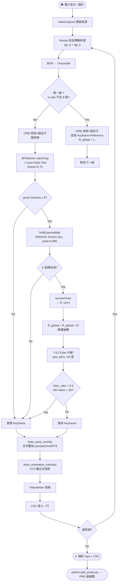
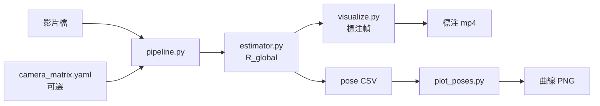

# Camera Pose Estimator — Architecture & Design

## 1. 系統概述 (System Overview)

本系統從預錄影片（隨機網路影片、室內/戶外/動態場景）提取每幀相對於**第0幀**的相機旋轉姿態，輸出 yaw、pitch、roll（角度制）。

| 項目 | 規格 |
|------|------|
| **輸入** | 影片檔 (mp4/avi/mov)、靜態圖片 |
| **輸出** | yaw/pitch/roll 度數、CSV、標注 mp4、曲線 PNG |
| **演算法** | ORB 特徵 + 5-point Essential Matrix (RANSAC) |
| **相機內參** | 近似法 `fx = fy = W`（無需校正）或 `camera_matrix.yaml` |
| **目標硬體** | Raspberry Pi 4B（ARM Cortex-A72，4 核，CPU-only） |
| **Python 相依** | `opencv-python>=4.8`, `numpy>=1.24`, `matplotlib>=3.7` |

---

## 2. 系統流程圖 (System Flowchart)



---

## 3. 模組職責 (Module Map)

```
2/
├── src/
│   ├── main.py        CLI 入口，argparse，呼叫 pipeline.run()
│   ├── pipeline.py    幀迴圈、EMA FPS、VideoWriter、CSV 寫入
│   ├── estimator.py   ORB + findEssentialMat + 累積 R → yaw/pitch/roll
│   └── visualize.py   draw_pose_overlay + draw_orientation_indicator
├── calibrate.py       棋盤格相機校正 → camera_matrix.yaml
├── plot_poses.py      matplotlib 三欄 PNG 曲線圖（離線）
├── benchmarks/
│   └── run_benchmark.py  解析度 × 場景掃描 → results.md
└── docs/
    └── architecture.md   本文件
```

### 資料流向



---

## 4. 座標系與 Euler 角定義

```
         Z (前方 / 光軸)
        /
       /
      +────► X (右)
      │
      ▼
      Y (下)        ← OpenCV 相機座標系
```

**分解順序：R = Ry(yaw) · Rx(pitch) · Rz(roll)**

| 角度 | 旋轉軸 | 物理意義 | 正方向 |
|------|--------|---------|--------|
| Yaw  | Y 軸   | 左右搖頭（Pan）| 右轉為正 |
| Pitch| X 軸   | 上下點頭（Tilt）| 下傾為正 |
| Roll | Z 軸   | 順逆時針側傾（Roll）| 順時針為正 |

**公式推導（YXZ 展開後）：**

```
R[1,2] = -sin(pitch)         → pitch = asin(-R[1,2])
R[0,2] = sin(yaw)·cos(pitch) → yaw   = atan2(R[0,2], R[2,2])
R[1,0] = cos(pitch)·sin(roll)→ roll  = atan2(R[1,0], R[1,1])
```

---

## 5. 關鍵演算法細節

### 5.1 ORB 特徵偵測

| 參數 | 預設值 | 說明 |
|------|--------|------|
| `nFeatures` | 500 | Pi 4B 480p 約 15–25 FPS |
| `nlevels` | 4 | 減少描述子計算量（預設 8） |

### 5.2 Lowe Ratio Test

```python
if m.distance < ratio_thresh * n.distance:   # 0.75 預設
    good.append(m)
```

濾除模糊匹配，保留高置信度對應點。

### 5.3 Essential Matrix（5-point 演算法）

```python
E, mask = cv2.findEssentialMat(pts1, pts2, K,
    method=cv2.RANSAC, prob=0.999, threshold=1.0)
```

- RANSAC 閾值 1px → 適合未畸變 / 近似內參場景
- 需要至少 5 對內點（使用 8 對以上的好匹配）

### 5.4 Pose 分解

```python
_, R, t, _ = cv2.recoverPose(E, pts1, pts2, K, mask=mask)
R_global = R_global @ R   # 累積旋轉
```

⚠️ **尺度模糊（Scale Ambiguity）：** 單目相機無法從 Essential Matrix 恢復絕對尺度，`t` 為單位向量，**平移不累積**。

### 5.5 關鍵幀策略

```python
if inlier_ratio < 0.5 or inlier_count < 60:
    # 替換參考幀，限制積累誤差
    self._ref_kp, self._ref_des = kp, des
```

---

## 6. 近似內參（無校正）

```
K = [[W, 0, W/2],
     [0, W, H/2],
     [0, 0,  1 ]]
```

假設 `fx = fy = W`，對應水平 FoV ≈ 53°。  
對手機/USB 攝影機旋轉估計誤差約 **±5–10°**。  
若需更高精度，執行 `calibrate.py` 產生 `camera_matrix.yaml`。

---

## 7. 使用技術清單 (Technologies Used)

| 技術 / 函式庫 | 版本需求 | 用途 |
|--------------|---------|------|
| **Python** | ≥ 3.10 | 主要語言 |
| **OpenCV** (`cv2`) | ≥ 4.8.0 | 特徵偵測、RANSAC、姿態分解、VideoCapture |
| **NumPy** | ≥ 1.24.0 | 矩陣運算、旋轉矩陣累積 |
| **Matplotlib** | ≥ 3.7.0 | 離線 yaw/pitch/roll 曲線圖 |
| **ORB** (OpenCV) | — | 二進制特徵描述子，Pi 4B CPU-friendly |
| **BFMatcher Hamming** | — | ORB 二進制描述子快速匹配 |
| **5-point Essential Matrix** | — | 最少 5 對點求解相對旋轉+平移 |
| **RANSAC** | — | 濾除外點，提升 E 矩陣穩健性 |
| **Raspberry Pi 4B** | — | 目標部署平台（ARM Cortex-A72，4 核） |

---

## 8. 效能估算（Raspberry Pi 4B）

| 目標寬度 | 解析度 | 預估 FPS |
|---------|--------|---------|
| 320 px  | 320×240 | 25–35 |
| 480 px  | 640×480 | 15–25 |
| 720 px  | 1280×720 | 8–12 |
| 1080 px | 1920×1080 | 4–6 |

> 以 `--nfeatures 500 --no-video` 為基準。加入 VideoWriter 寫檔會降低 2–4 FPS。

---

## 9. 相對 vs 絕對姿態

本系統輸出**相對旋轉姿態**（相對第 0 幀）。

**絕對姿態難度高的原因：**

| 問題 | 解釋 |
|------|------|
| 世界原點未知 | 需 IMU 量重力向量 / 已知場景幾何 / 基準標記 |
| 尺度模糊 | 單目無法量距離，需立體相機或已知尺寸物體 |
| 無限漂移 | 需回環偵測（Loop Closure）→ 完整 SLAM 管線 |
| 計算量龐大 | ORB-SLAM3 等完整 SLAM 系統在 Pi 4B 僅 5–10 FPS |
