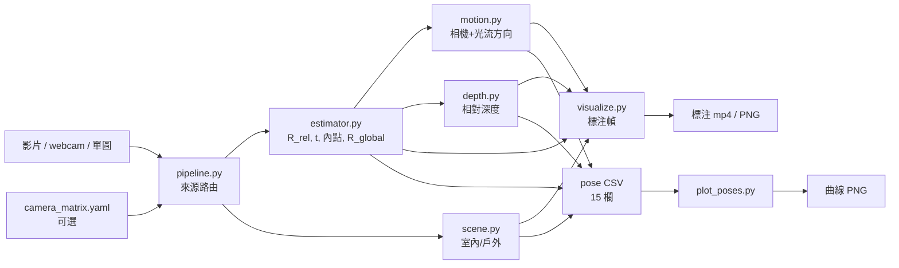

# Camera Pose Estimator — Architecture & Design

## 1. 系統概述 (System Overview)

本系統從預錄影片（隨機網路影片、室內/戶外/動態場景）提取每幀相對於**第0幀**的相機旋轉姿態，輸出 yaw、pitch、roll（角度制）。

| 項目 | 規格 |
|------|------|
| **輸入** | 影片檔 (mp4/avi/mov)、即時攝影機（整數索引）、靜態圖片 |
| **輸出** | yaw/pitch/roll 度數、室內/戶外、動態方向、相對深度、CSV、標注 mp4/PNG、曲線 PNG |
| **演算法** | ORB 特徵 + 5-point Essential Matrix (RANSAC) |
| **相機內參** | 近似法 `fx = fy = W`（無需校正）或 `camera_matrix.yaml` |
| **目標硬體** | Raspberry Pi 4B（ARM Cortex-A72，4 核，CPU-only） |
| **Python 相依** | `opencv-python>=4.8`, `numpy>=1.24`, `matplotlib>=3.7` |

---

## 2. 系統流程圖 (System Flowchart)


---

## 3. 模組職責 (Module Map)

```
2/
├── src/
│   ├── main.py        CLI 入口，argparse，source_is_available()，呼叫 pipeline.run()
│   ├── pipeline.py    來源路由（影片/webcam/單圖）、幀迴圈、CSV 寫入、串接 scene/motion/depth
│   ├── estimator.py   ORB + findEssentialMat + recoverPose → yaw/pitch/roll、回傳 R_rel/t/內點
│   ├── scene.py       室內/戶外：SceneClassifier(cv2.dnn+Places365) + 古典 HSV fallback
│   ├── motion.py      camera_motion(t) + flow_direction(內點) → 動態方向 / zoom
│   ├── depth.py       triangulatePoints → 相對稀疏深度 + NEAR/MID/FAR
│   ├── orient.py      單圖水平線 → roll/pitch（Canny+HoughLinesP）+ ypr_to_R
│   └── visualize.py   draw_pose_overlay（含 SCN/MOV/DEP）+ draw_orientation_indicator
├── models/
│   ├── export_places365_onnx.py  一次性：下載+轉 Places365 ResNet18 → ONNX
│   ├── io_places365.txt          365 行 1=室內/2=戶外
│   └── places365_resnet18.onnx   (git-ignored, 45MB) cv2.dnn 載入用
├── calibrate.py       棋盤格相機校正 → camera_matrix.yaml
├── plot_poses.py      matplotlib 三欄 PNG 曲線圖（離線）
├── benchmarks/
│   └── run_benchmark.py  解析度 × 場景掃描 → results.md
├── tests/             pytest 單元測試（scene/motion/depth/estimator/pipeline/main）
└── docs/
    └── architecture.md   本文件
```

### 資料流向



### 資料契約 — CSV 列（JSON Schema）

```json
{
  "type": "object",
  "properties": {
    "frame_idx":   { "type": "integer" },
    "timestamp_s": { "type": "number" },
    "yaw_deg":     { "type": ["number", "string"], "description": "度；單圖為 'N/A'" },
    "pitch_deg":   { "type": ["number", "string"] },
    "roll_deg":    { "type": ["number", "string"] },
    "fps":         { "type": "number" },
    "inliers":     { "type": ["integer", "string"], "description": "-1=參考幀；單圖 'N/A'" },
    "nfeatures":   { "type": ["integer", "string"] },
    "scene":       { "type": "string", "enum": ["indoor", "outdoor"] },
    "scene_conf":  { "type": "number", "minimum": 0.5, "maximum": 1.0 },
    "cam_motion":  { "type": "string", "enum": ["FWD","BACK","LEFT","RIGHT","UP","DOWN","STILL","N/A"] },
    "flow_motion": { "type": "string", "enum": ["PAN-L","PAN-R","TILT-U","TILT-D","STILL","N/A"] },
    "zoom_in":     { "type": ["integer", "string"], "enum": [0, 1, "N/A"] },
    "rel_depth":   { "type": ["number", "string"], "description": "baseline 單位（相對，非絕對）；'N/A' 無解" },
    "depth_level": { "type": "string", "enum": ["NEAR", "MID", "FAR", "N/A"] }
  }
}
```

---

## 4. 座標系與 Euler 角定義

```
         Z (前方 / 光軸)
        /
       /
      +────► X (右)
      │
      ▼
      Y (下)        ← OpenCV 相機座標系
```

**分解順序：R = Ry(yaw) · Rx(pitch) · Rz(roll)**

| 角度 | 旋轉軸 | 物理意義 | 正方向 |
|------|--------|---------|--------|
| Yaw  | Y 軸   | 左右搖頭（Pan）| 右轉為正 |
| Pitch| X 軸   | 上下點頭（Tilt）| 下傾為正 |
| Roll | Z 軸   | 順逆時針側傾（Roll）| 順時針為正 |

**公式推導（YXZ 展開後）：**

```
R[1,2] = -sin(pitch)         → pitch = asin(-R[1,2])
R[0,2] = sin(yaw)·cos(pitch) → yaw   = atan2(R[0,2], R[2,2])
R[1,0] = cos(pitch)·sin(roll)→ roll  = atan2(R[1,0], R[1,1])
```

---

## 5. 關鍵演算法細節

### 5.1 ORB 特徵偵測

| 參數 | 預設值 | 說明 |
|------|--------|------|
| `nFeatures` | 500 | Pi 4B 480p 約 15–25 FPS |
| `nlevels` | 4 | 減少描述子計算量（預設 8） |

### 5.2 Lowe Ratio Test

```python
if m.distance < ratio_thresh * n.distance:   # 0.75 預設
    good.append(m)
```

濾除模糊匹配，保留高置信度對應點。

### 5.3 Essential Matrix（5-point 演算法）

```python
E, mask = cv2.findEssentialMat(pts1, pts2, K,
    method=cv2.RANSAC, prob=0.999, threshold=1.0)
```

- RANSAC 閾值 1px → 適合未畸變 / 近似內參場景
- 需要至少 5 對內點（使用 8 對以上的好匹配）

### 5.4 Pose 分解

```python
_, R, t, _ = cv2.recoverPose(E, pts1, pts2, K, mask=mask)
R_global = R_global @ R   # 累積旋轉
```

⚠️ **尺度模糊（Scale Ambiguity）：** 單目相機無法從 Essential Matrix 恢復絕對尺度，`t` 為單位向量，**平移不累積**。

### 5.5 關鍵幀策略

```python
if inlier_ratio < 0.5 or inlier_count < 60:
    # 替換參考幀，限制積累誤差
    self._ref_kp, self._ref_des = kp, des
```

---

## 6. 近似內參（無校正）

```
K = [[W, 0, W/2],
     [0, W, H/2],
     [0, 0,  1 ]]
```

假設 `fx = fy = W`，對應水平 FoV ≈ 53°。  
對手機/USB 攝影機旋轉估計誤差約 **±5–10°**。  
若需更高精度，執行 `calibrate.py` 產生 `camera_matrix.yaml`。

---

## 7. 使用技術清單 (Technologies Used)

| 技術 / 函式庫 | 版本需求 | 用途 |
|--------------|---------|------|
| **Python** | ≥ 3.10 | 主要語言 |
| **OpenCV** (`cv2`) | ≥ 4.8.0 | 特徵偵測、RANSAC、姿態分解、VideoCapture |
| **NumPy** | ≥ 1.24.0 | 矩陣運算、旋轉矩陣累積 |
| **Matplotlib** | ≥ 3.7.0 | 離線 yaw/pitch/roll 曲線圖 |
| **ORB** (OpenCV) | — | 二進制特徵描述子，Pi 4B CPU-friendly |
| **BFMatcher Hamming** | — | ORB 二進制描述子快速匹配 |
| **5-point Essential Matrix** | — | 最少 5 對點求解相對旋轉+平移 |
| **RANSAC** | — | 濾除外點，提升 E 矩陣穩健性 |
| **Raspberry Pi 4B** | — | 目標部署平台（ARM Cortex-A72，4 核） |

---

## 8. 效能估算（Raspberry Pi 4B）

| 目標寬度 | 解析度 | 預估 FPS |
|---------|--------|---------|
| 320 px  | 320×240 | 25–35 |
| 480 px  | 640×480 | 15–25 |
| 720 px  | 1280×720 | 8–12 |
| 1080 px | 1920×1080 | 4–6 |

> 以 `--nfeatures 500 --no-video` 為基準。加入 VideoWriter 寫檔會降低 2–4 FPS。

---

## 9. 相對 vs 絕對姿態

本系統輸出**相對旋轉姿態**（相對第 0 幀）。

**絕對姿態難度高的原因：**

| 問題 | 解釋 |
|------|------|
| 世界原點未知 | 需 IMU 量重力向量 / 已知場景幾何 / 基準標記 |
| 尺度模糊 | 單目無法量距離，需立體相機或已知尺寸物體 |
| 無限漂移 | 需回環偵測（Loop Closure）→ 完整 SLAM 管線 |
| 計算量龐大 | ORB-SLAM3 等完整 SLAM 系統在 Pi 4B 僅 5–10 FPS |

---

## 10. 場景 / 動態方向 / 深度（新增模組）

### 10.1 室內 / 戶外（`scene.py`）
古典 CV 啟發式（無 ML），HSV 空間計算三線索並加權：
- `sky_frac`：上 1/3 區域中「高 V + (低 S 或藍色 hue 90–140)」像素佔比
- `veg_frac`：全幀綠色 hue(35–85) 飽和像素佔比
- `bright_norm`：整體亮度正規化
分數 `0.4·sky + 0.35·veg + 0.25·bright ≥ 0.35` → outdoor，否則 indoor。confidence ∈ [0.5,1.0]。
> 精度為「大致正確」；邊界場景（室內大窗）可能誤判。每 10 幀重算一次以省 Pi 成本。

### 10.2 動態方向（`motion.py`）
- `camera_motion(t)`：`recoverPose` 的單位 `t`（相機系 X右/Y下/Z前）取主導分量 → FWD/BACK/LEFT/RIGHT/UP/DOWN/STILL
- `flow_direction(內點)`：內點中位位移 → PAN-L/PAN-R/TILT-U/TILT-D（慣例：畫面右移=相機左轉）；相對質心的徑向發散 → `zoom_in`

### 10.3 相對深度（`depth.py`）
`P1=K[I|0]`、`P2=K[R_rel|t]` → `cv2.triangulatePoints` → 取正 Z 中位數。  
⚠️ 單目尺度模糊：`t` 為單位向量，深度以 **baseline 單位** 表示（相對，非公尺）。固定門檻分 NEAR(<5)/MID/FAR(>15)。  
重用姿態管線既有的 `R_rel, t, 內點`，額外成本僅一次三角化，適合 Pi 4B。

---

### 10.4 室內/戶外升級：cv2.dnn + Places365（取代啟發式為主路徑）
古典啟發式在夜景/雪地/明亮室內失準（實測 3/6）。改用 `SceneClassifier`：`cv2.dnn.readNetFromONNX` 載入 Places365 ResNet18 → softmax → 依官方 IO 表 `aggregate_io` 彙總 indoor/outdoor（實測 6/6）。推論時不需 PyTorch，每 N 幀跑一次，Pi 4B 可承受；無模型檔時 `try_load` 自動退回啟發式。

### 10.5 單圖 XYZ：水平線傾斜（`orient.py`）
單圖無相對旋轉 → yaw 不可觀測（=0）。以 Canny + HoughLinesP 取主導水平線 → roll（線傾角）、pitch（線高度）→ `ypr_to_R` → 與影片共用 XYZ 指示器繪製。

---

## Last Updated
2026-06-03 — 室內/戶外改用 `cv2.dnn` + Places365 ResNet18（保留 HSV fallback，準確率 3/6→6/6）；新增 `orient.py` 單圖水平線傾斜 → XYZ；單圖 overlay 移除 FPS、yaw=N/A 而 roll/pitch 由水平線估計；新增 `models/` 與 `--scene-model/--scene-io`。前次：新增 scene/motion/depth、estimator 9-tuple、單圖分支、webcam、CSV 15 欄、tests/。
