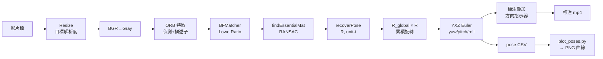

# Camera Pose Estimator — Yaw / Pitch / Roll + Scene / Motion / Depth

> 從影片、即時攝影機或單張圖片提取相機姿態與場景資訊，專為 **Raspberry Pi 4B** 設計。  
> 純 CPU、無 ML 模型、僅依賴 `opencv-python`。

---

## What / Why / How

### What（這個專案做什麼）
輸入一段影片、即時 webcam 或單張圖片，輸出：
- **yaw / pitch / roll**（相機相對旋轉姿態，度）
- **室內 / 戶外**（indoor / outdoor）
- **動態方向**（相機運動方向 + 畫面光流方向 + zoom）
- **相對深度**（NEAR / MID / FAR，尺度相對非絕對）
- **FPS@解析度**

### Why（為什麼這樣設計）
- 目標硬體是 **Raspberry Pi 4B（CPU-only）**，所以全程**純 OpenCV、無深度學習模型**，才能即時跑。
- 動態方向與深度幾乎**零額外成本**：姿態管線 `recoverPose` 早已算出 `R / t / 內點匹配`，過去被丟棄，現在直接重用做運動方向與三角化深度。
- 室內/戶外用**古典 CV 啟發式**（天空藍佔比 / 植被綠 / 亮度），輕量但僅「大致正確」。

### How（怎麼運作）
1. ORB 特徵 + BFMatcher + Lowe Ratio 找對應點
2. `findEssentialMat`(RANSAC) → `recoverPose` 取相對 `R, t` 與內點
3. 累積 `R_global` → YXZ Euler 分解出 yaw/pitch/roll
4. `t` → 相機運動方向；內點位移 → 光流方向 / zoom
5. `triangulatePoints(K[I|0], K[R|t])` → 相對稀疏深度 → 分級
6. 每幀（場景每 10 幀）疊加 overlay + 寫 CSV

> ⚠️ **單張圖片限制**：姿態與動態方向本質需 ≥2 幀，單圖只輸出**室內/戶外**，其餘標 `N/A`。

---

## 功能特色

| 項目 | 說明 |
|------|------|
| **輸入** | 影片檔 (mp4/avi/mov)、即時攝影機（`0`/`1`…）、單張圖片 (jpg/png…) |
| **輸出** | yaw/pitch/roll (°)、室內/戶外、動態方向、相對深度、FPS@解析度、標注 mp4/PNG、CSV、曲線圖 |
| **演算法** | ORB + 5-point Essential Matrix (RANSAC) + 三角化深度 + 古典 CV 場景啟發式 |
| **內參** | 近似法（fx=fy=W）或 `camera_matrix.yaml`（校正） |
| **硬體目標** | Raspberry Pi 4B，15–25 FPS @ 480p |
| **場景** | 室內 / 戶外 / 動態，任意場景皆可 |

---

## 系統流程圖



詳細設計見 [`docs/architecture.md`](docs/architecture.md)。

---

## 快速開始

```bash
# 1. 安裝相依套件
pip install -r requirements.txt

# 2. 執行姿態估計（影片 / 即時攝影機 / 單張圖片）
python src/main.py test_inputs/indoor_office.mp4
python src/main.py 0                 # 即時 webcam（索引 0）
python src/main.py photo.jpg         # 單張圖片 → 只輸出室內/戶外

# 3. 繪製曲線圖
python plot_poses.py runs/indoor_office_pose.csv

# 4. 多解析度 Benchmark
python benchmarks/run_benchmark.py --videos test_inputs/
```

---

## 輸出格式

### 標注影片 (mp4)

- 左上角：YAW / PIT / ROL 數值 + FPS@解析度 + 特徵點數
- 右上角：XYZ 方向指示器（正交投影）

### CSV (`runs/<stem>_pose.csv`)

```
frame_idx,timestamp_s,yaw_deg,pitch_deg,roll_deg,fps,inliers,nfeatures,scene,scene_conf,cam_motion,flow_motion,zoom_in,rel_depth,depth_level
0,0.000,0.00,0.00,0.00,11.2,-1,500,indoor,0.89,STILL,N/A,0,N/A,N/A
1,0.033,0.69,0.08,-0.17,14.6,67,500,indoor,0.89,FWD,PAN-L,0,42.48,FAR
```

| 欄位 | 說明 |
|------|------|
| `scene` / `scene_conf` | indoor/outdoor 與信心值 [0.5,1.0] |
| `cam_motion` | 相機運動方向 FWD/BACK/LEFT/RIGHT/UP/DOWN/STILL（由 `t`） |
| `flow_motion` | 畫面光流方向 PAN-L/PAN-R/TILT-U/TILT-D/STILL/N/A |
| `zoom_in` | 1 = 特徵向外發散（推近） |
| `rel_depth` / `depth_level` | 相對深度中位數（baseline 單位，**非絕對**）+ NEAR/MID/FAR |

> 單張圖片輸入時：`yaw/pitch/roll/cam_motion/flow_motion/depth_level` 皆為 `N/A`，僅 `scene` 有值，並輸出 `runs/<stem>_pose.png`。

### PNG 曲線圖

```bash
python plot_poses.py runs/<stem>_pose.csv
```

三欄圖：yaw / pitch / roll 對時間（秒）。

---

## CLI 參數

```
usage: python src/main.py <source> [options]

positional:
  source               影片或圖片檔路徑

輸出:
  --output -o PATH     輸出 mp4 路徑（預設: runs/<stem>_pose.mp4）
  --no-show            不顯示視窗（無頭模式）
  --no-video           不輸出 mp4（僅 CSV）

解析度:
  --imgsz INT          目標寬度 px（預設: 640，0=保持原始）
  --pi-sim             強制 640×480（Pi 4B 模擬）

演算法調整:
  --nfeatures INT      ORB 最大特徵數（預設: 500）
  --ratio-thresh FLOAT Lowe Ratio 閾值（預設: 0.75）
  --ransac-thresh FLOAT RANSAC 閾值 px（預設: 1.0）
  --keyframe-ratio FLOAT inlier ratio < X 時替換關鍵幀（預設: 0.5）
  --keyframe-inliers INT inlier count < X 時替換關鍵幀（預設: 60）

校正:
  --calib PATH         camera_matrix.yaml（由 calibrate.py 產生）
```

---

## 相機校正（選用）

若需更高精度（±1–2° 以下），先執行棋盤格校正：

```bash
# 拍攝 9×6 棋盤格（10×7 方格）≥ 15 張
python calibrate.py --images calib_images/ --output my_camera.yaml
python src/main.py video.mp4 --calib my_camera.yaml
```

不校正時使用 `fx = fy = W` 近似，對旋轉趨勢誤差約 5–10°。

---

## Benchmark

```bash
# 命名規則: indoor_*.mp4 / outdoor_*.mp4 / dynamic_*.mp4
python benchmarks/run_benchmark.py --videos test_inputs/
# 結果寫入 benchmarks/results.md
```

掃描 320 / 480 / 720 / 1080 px × 室內 / 戶外 / 動態場景。

---

## 演算法簡介

| 步驟 | 方法 | 說明 |
|------|------|------|
| 特徵偵測 | ORB (nFeatures=500, nlevels=4) | Pi 4B CPU-friendly，二進制描述子 |
| 特徵匹配 | BFMatcher Hamming + Lowe Ratio (0.75) | 濾除模糊對應 |
| 姿態求解 | findEssentialMat (RANSAC, 1px) | 5-point 演算法 |
| 旋轉分解 | recoverPose → R | 單位平移向量（尺度模糊不累積） |
| 累積 | R_global = R_global × R | 相對第 0 幀的累積旋轉 |
| Euler | YXZ 分解 (Ry·Rx·Rz) | yaw(Y) / pitch(X) / roll(Z) |
| 關鍵幀 | inlier ratio < 50% → 替換參考幀 | 限制漂移 |

---

## Pi 4B 效能參考

| `--imgsz` | 解析度 | 預估 FPS |
|-----------|--------|---------|
| 320 | 320×240 | 25–35 |
| 480 | 640×480 | 15–25 |
| 720 | 1280×720 | 8–12 |
| 1080 | 1920×1080 | 4–6 |
