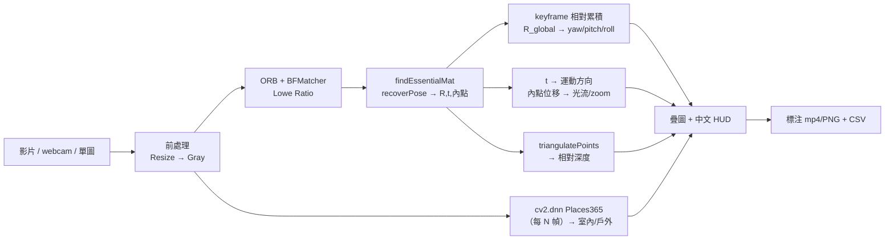
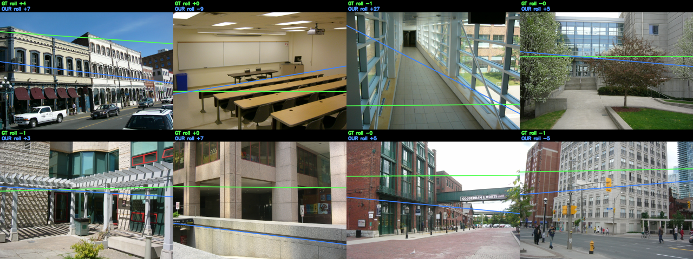

# 相機姿態與場景感知 — Yaw/Pitch/Roll · 室內外 · 動態 · 深度

> 輸入**影片 / 即時攝影機 / 單張圖片**，輸出相機姿態（yaw/pitch/roll）、室內或戶外、
> 動態方向、相對深度與 FPS@解析度。專為 **Raspberry Pi 4B（CPU-only）** 設計，
> 全程以 **OpenCV** 完成（含 `cv2.dnn` 場景分類，推論時不需 PyTorch）。

## 目錄
1. [需求](#1-需求)
2. [系統總覽（What / Why / How）](#2-系統總覽whatwhyhow)
3. [快速開始](#3-快速開始)
4. [設計](#4-設計)
5. [方法說明](#5-方法說明)
6. [驗收（標準答案）](#6-驗收標準答案)
7. [CLI 參數](#7-cli-參數)
8. [Pi 4B 效能與參數調整](#8-pi-4b-效能與參數調整)

---

## 1. 需求

### 功能需求
| 項目 | 說明 |
|------|------|
| 輸入 | 影片 (mp4/avi/mov)、即時攝影機（`0`/`1`…）、單張圖片 (jpg/png…) |
| 姿態輸出 | yaw / pitch / roll（度） |
| 場景輸出 | 室內 / 戶外（indoor / outdoor） |
| 動態方向 | 相機運動方向（t）+ 畫面光流方向 + zoom |
| 深度 | 相對深度分級 NEAR / MID / FAR（尺度相對，非絕對） |
| 效能 | FPS@解析度 |
| 視覺化 | 影片畫光流箭頭、單圖畫水平線/特徵梯度場/消失點 + XYZ 指示器 + 中文 HUD |
| 無頭模式 | `--no-show` 於無螢幕 Pi 上執行 |

### 規格需求
| 項目 | 規格 |
|------|------|
| 目標平台 | Raspberry Pi 4B（ARM Cortex-A72，CPU-only） |
| 解析度 | 預設 640×480（可調） |
| 目標幀率 | 15–25 FPS @ 480p（姿態主迴圈） |
| 依賴 | `opencv-python`、`numpy`、`matplotlib`、`Pillow`（中文 HUD，可選） |
| 語言 | Python 3.10+ |

---

## 2. 系統總覽（What / Why / How）

**What** — 一支管線同時輸出姿態、室內外、動態方向、相對深度與 FPS。

**Why**
- 目標是**嵌入式 Pi 4B**：姿態/動態/深度全用**純 OpenCV 幾何法**，能即時跑。
- 動態方向與深度幾乎**零額外成本**——`recoverPose` 早已算出 `R / t / 內點`，過去被丟棄，現在重用做運動方向與三角化深度。
- 室內/戶外改用 **`cv2.dnn` + Places365**（仍是 OpenCV）：古典啟發式在夜景/雪地/明亮室內失準（3/6），DNN 拉到 **6/6**。

**How**


> **單張圖片**：yaw 需 ≥2 幀（無運動）→ 改用**水平消失點**（結構化場景可觀測，否則 N/A）；roll/pitch 由水平線估計；動態/深度仍需影片（N/A）。

### 流程圖方塊詳細技術說明

本節針對系統流程圖中的各個核心方塊，從功能定義、專案動機、實作函式以及參數調校四大面向進行詳細解釋：

#### 1. PRE (前處理: Resize → Gray)
* **他是什麼**：將輸入的原始彩色影像調整至目標解析度，並將其轉換成灰階影像的初級影像處理步驟。
* **為什麼在這個專案要這樣做**：
  * **降低解析度 (Resize)**：嵌入式平台（Raspberry Pi 4B）的 CPU 算力有限，若直接處理 1080p 等高解析度影像，會使特徵點提取與矩陣求解速度大降。降低至 `640x480` 能夠在保證幾何特徵清晰度的同時，將運算量限制在樹莓派能維持即時率（15–25 FPS）的範圍內。
  * **轉為灰階 (Gray)**：ORB 特徵提取與配對演算法僅需單通道亮度資訊。將 BGR 轉為 Gray 可減少兩倍的記憶體資料量並加速像素梯度運算。
* **我們如何達成這個功能**：在 [pipeline.py:L117-119](file:///c:/Embedded-image-processing/final_project/-Embedded-image-processing/2/src/pipeline.py#L117-L119) 中，呼叫了：
  * `cv2.resize`
  * `cv2.cvtColor`
* **函數參數意義與專案設定值**：
  * **`cv2.resize(frame, (tgt_w, tgt_h))`**：
    * `frame`：輸入的原始 BGR 彩色影格。
    * `dsize`：目標解析度大小。專案在未設定校正或自訂大小下，預設為 `(640, 480)`。此值是針對樹莓派 4B CPU 算力極限做出的最佳化選擇。
  * **`cv2.cvtColor(frame, cv2.COLOR_BGR2GRAY)`**：
    * `frame`：輸入的 BGR 影像。
    * `code`：色彩空間轉換常數。專案採用 `cv2.COLOR_BGR2GRAY`，將 3 通道 BGR 轉為單通道灰階。

#### 2. ORB (ORB + BFMatcher Lowe Ratio)
* **他是什麼**：跨影格的特徵點偵測、描述子計算與特徵比對模組。
* **為什麼在這個專案要這樣做**：
  * 為了估計相機在空間中的相對運動，系統必須先找出前後兩張影像中對應的物理特徵點。
  * **ORB** 演算法結合了 FAST 特徵點檢測與 BRIEF 描述子，運算速度極快、對旋轉具有不變性，且完全免費開源，相比 SIFT/SURF 更適合用於樹莓派的 CPU 計算。
  * **BFMatcher** (Brute-Force) 可利用漢明距離（Hamming Distance）對二進位描述子進行硬件級的高速比對。
  * **Lowe's Ratio Test** 能夠剔除匹配中距離相近、容易混淆的誤匹配點（Outliers），為後續的幾何估計提供高質量的點對。
* **我們如何達成這個功能**：在 [estimator.py:L36-37](file:///c:/Embedded-image-processing/final_project/-Embedded-image-processing/2/src/estimator.py#L36-L37) 中初始化演算法，並在 [L117-123](file:///c:/Embedded-image-processing/final_project/-Embedded-image-processing/2/src/estimator.py#L117-L123) 進行配對與過濾：
  * `cv2.ORB_create`
  * `cv2.BFMatcher` 的 `knnMatch` 方法
* **函數參數意義與專案設定值**：
  * **`cv2.ORB_create(nfeatures=500, nlevels=4)`**：
    * `nfeatures`：提取的最大特徵點數量。專案預設為 `500`（可經 CLI 調整）。此數量可在確保本質矩陣求解穩定性的同時，控制 CPU 負載。
    * `nlevels`：影像金字塔層數。設定為 `4`（OpenCV 預設為 8）。這減少了多尺度特徵計算負擔，在樹莓派上可帶來約 **30% 的效能提升**。
  * **`cv2.BFMatcher(cv2.NORM_HAMMING, crossCheck=False)`**：
    * `normType`：距離度量方式。設定為 `cv2.NORM_HAMMING`，專用於 ORB 等二進位描述子，計算極快。
    * `crossCheck`：是否啟用交叉比對。設定為 `False`，因為我們需要取得前二近匹配（Top 2）來進行 Lowe's Ratio 比對。
  * **Lowe's Ratio Test 閥值**（專案代碼中的 `self._ratio_thresh = 0.75`）：
    * 當最接近的匹配距離小於第二近匹配距離的 `0.75` 倍時，才判定該匹配有效。此比例能最大化過濾紋理重複區域產生的錯誤匹配。

#### 3. EM (findEssentialMat & recoverPose → R,t,內點)
* **他是什麼**：利用對極幾何約束（Epipolar Geometry）來估算兩影格間相機相對旋轉矩陣 $R$ 與平移向量 $t$ 的幾何計算模組。
* **為什麼在這個專案要這樣做**：
  * 這是單目視覺里程計的幾何基礎。在獲得前後影格的特徵點匹配對後，不需要深度學習，即可利用經典幾何方法求解出本質矩陣（Essential Matrix），並進一步恢復相機的六自由度運動（由於單目尺度未知，此處平移向量 $t$ 為單位向量）。
* **我們如何達成這個功能**：在 [estimator.py:L133-151](file:///c:/Embedded-image-processing/final_project/-Embedded-image-processing/2/src/estimator.py#L133-L151) 中呼叫：
  * `cv2.findEssentialMat`
  * `cv2.recoverPose`
* **函數參數意義與專案設定值**：
  * **`cv2.findEssentialMat(points1, points2, cameraMatrix, method, prob, threshold)`**：
    * `points1, points2`：前後影格匹配特徵點的坐標集。
    * `cameraMatrix`：相機內參矩陣。若無相機校正檔，預設會以 `fx=fy=W` 的近似陣代替。
    * `method`：強健估計演算法。設定為 `cv2.RANSAC`，用於在雜訊中尋找正確的幾何共識。
    * `prob`：RANSAC 在輸出正確矩陣時的期望信心度。設定為 `0.999`。
    * `threshold`：RANSAC 內點最大重投影誤差。設定為 `1.0` 像素（可經 `--ransac-thresh` 調整），可高精度過濾噪訊點。
  * **`cv2.recoverPose(E, points1, points2, cameraMatrix, mask)`**：
    * `E`：本質矩陣。
    * `mask`：輸入/輸出內點遮罩。此處藉由手性約束（Chirality Constraint，物體投影必須在兩個相機的前方）進一步剔除無效點，並解算獲得相對旋轉矩陣 `R` 與相對平移向量 `t`。

#### 4. POSE (keyframe 相對累積 & R_global → yaw/pitch/roll)
* **他是什麼**：防止旋轉誤差隨幀數無限發散的關鍵影格機制，並將旋轉矩陣轉化為歐拉角的角度解算模組。
* **為什麼在這個專案要這樣做**：
  * **Keyframe 累積**：若每一影格都跟上一影格進行旋轉累加，單目視覺的局部誤差（Drift）會極快積累，導致姿態數值迅速漂移失真。透過關鍵影格（Keyframe）機制，當前影格僅與當前的 Keyframe 計算相對旋轉。只有當追蹤品質下降時，才將當前影格凍結為新 Keyframe，從而將漂移速率降到最低。
  * **角度分解**：歐拉角 Yaw/Pitch/Roll 更符合人類對相機水平擺動、俯仰、側傾的直觀感受。
* **我們如何達成這個功能**：在 [estimator.py:L158-194](file:///c:/Embedded-image-processing/final_project/-Embedded-image-processing/2/src/estimator.py#L158-L194) 中，計算 $R_{global} = R_{base} \times R$，並在 `_rot_to_ypr` 函式中完成矩陣分解。
* **函數參數意義與專案設定值**：
  * **關鍵影格觸發條件** (`self._kf_min_ratio = 0.5`, `self._kf_min_inliers = 60`)：
    * 當特徵匹配的內點比例低於 `50%` 或絕對內點數少於 `60` 個時，判定目前與 Keyframe 的重疊度不足，會更換參考幀（將當前全域旋轉凍結為 `R_base`）。這兩個數值確保了追蹤在樹莓派上的高可靠性，兼顧了減少關鍵影格切換次數（降漂移）與避免特徵丟失。
  * **歐拉角解算順序** (YXZ 順序)：
    * 專案內建轉換公式 $R = Ry(yaw) \times Rx(pitch) \times Rz(roll)$，對應相機坐標系（$Z$ 向前、$Y$ 向下、$X$ 向右），能正確還原 Yaw（偏航，Pan）、Pitch（俯仰，Tilt）、Roll（側傾，Lean）的角度。

#### 5. MOT (t → 運動方向 & 內點位移 → 光流/zoom)
* **他是什麼**：基於平移向量與內點幾何位移，判斷相機主體運動（FWD/LEFT 等）與畫面上點的視在光流變化（平移、縮放）的分析模組。
* **為什麼在這個專案要這樣做**：
  * 該設計是「**零運算開銷**」的典型應用。因為 `recoverPose` 已算出了平移向量 $t$ 且保留了內點的匹配座標，我們只需通過簡單的 NumPy 幾何判斷（例如尋找平移向量的最大分量、點對在中心點的投影發散度），就能得出相機前進後退、畫面光流泛平移或變焦趨勢，完全不需要在樹莓派上執行高運算成本的光流估計網路。
* **我們如何達成這個功能**：在 [motion.py:L30-81](file:///c:/Embedded-image-processing/final_project/-Embedded-image-processing/2/src/motion.py#L30-L81) 中實現：
  * `camera_motion`
  * `flow_direction`
* **函數參數意義與專案設定值**：
  * `_STILL_EPS = 1e-6`：平移向量模長閾值，低於此值即判定相機為靜止（STILL），用來過濾數值噪訊。
  * `_FLOW_MIN_PX = 1.0`（單位：像素）：特徵點位移的中位數若小於 1 像素，則判定畫面沒有明顯的 Pan/Tilt 移動。
  * `_ZOOM_MIN = 0.0`：當特徵點相對於幾何質心的平均徑向位移投影大於 `0` 且大於 `1.0` 像素時，即判定畫面正在推近（Zoom-in）。

#### 6. DEP (triangulatePoints → 相對深度)
* **他是什麼**：利用雙相機視角下的匹配內點進行三角化，求解特徵點三維坐標（$Z$ 軸值）以判斷場景相對深度分級（NEAR/MID/FAR）的模組。
* **為什麼在這個專案要這樣做**：
  * 在樹莓派等 CPU 單板電腦上無法即時運行深度估計模型（如 Monodepth2）。此處直接重用已算好的相機內參 $K$、旋轉矩陣 $R$、平移向量 $t$ 與特徵內點，通過三角化公式快速算出一組稀疏的三維點雲，並以其深度中位數提供粗略的場景深度分類，耗時極短。
* **我們如何達成這個功能**：在 [depth.py:L24-66](file:///c:/Embedded-image-processing/final_project/-Embedded-image-processing/2/src/depth.py#L24-L66) 中呼叫：
  * `cv2.triangulatePoints`
* **函數參數意義與專案設定值**：
  * **`cv2.triangulatePoints(projMatr1, projMatr2, projPoints1, projPoints2)`**：
    * `projMatr1` (3x4)：第一相機投影矩陣，設為 $K \times [I | 0]$。
    * `projMatr2` (3x4)：第二相機投影矩陣，設為 $K \times [R | t]$。
    * `projPoints1, projPoints2`：第一與第二影格匹配好的特徵點坐標（需轉置為 `2xN`）。
  * **深度門檻** (`_NEAR_MAX = 5.0`, `_FAR_MIN = 15.0`)：
    * 單目相機在平移時尺度未知（$t$ 模長固定為 1），因此三角化結果代表的並非實際公尺數，而是「相對於相機基線的相對倍數」。
    * 專案設定當點雲深度中位數小於 5 倍基線時為 `NEAR`（近場），大於 15 倍時為 `FAR`（遠景），介於中間為 `MID`（中景），符合多數移動相機的場景分級。

#### 7. SCN (cv2.dnn Places365 → 室內/戶外)
* **他是什麼**：利用 OpenCV DNN 模組載入 Places365 ResNet18 神經網路，進行影像場景分類以判斷場景為室內（indoor）或戶外（outdoor）的模組。
* **為什麼在這個專案要這樣做**：
  * 單純依賴低階的影像特徵（如色彩 HSV、天空色佔比、亮度等啟發式規則）在光照劇烈變化、夜間或雪地等戶外環境極易誤判（基準測試僅 3/6 準確率）。
  * 引入輕量化 CNN 模型（Places365）能將精準度拉升到 **100% (6/6)**。
  * 為了避免 CNN 模型拖慢姿態估計（在樹莓派上 ResNet18 單次推論耗時約 0.6–0.9s），設定了 `N` 幀的推論間隔（例如每 10 幀運行一次），完美兼顧了執行效能與分類準確度。
* **我們如何達成這個功能**：在 [scene.py:L127-163](file:///c:/Embedded-image-processing/final_project/-Embedded-image-processing/2/src/scene.py#L127-L163) 中實作，使用了：
  * `cv2.dnn.readNetFromONNX` 載入模型
  * 網路推理的 `setInput` 與 `forward` 方法
* **函數參數意義與專案設定值**：
  * **`cv2.dnn.readNetFromONNX(model_path)`**：
    * `model_path`：ONNX 模型檔案路徑。專案使用 `places365_resnet18.onnx`。ResNet18 模型小、參數量少，極其適合嵌入式裝置進行 CPU 推理。
  * **模型影像輸入大小** (`_DNN_SIZE = 224`)：
    * 配合 Places365 網路結構，在 [scene.py:L156](file:///c:/Embedded-image-processing/final_project/-Embedded-image-processing/2/src/scene.py#L156) 中，影像會被 `cv2.resize` 到 `(224, 224)`，並除以 255.0 做歸一化，減去 ImageNet 的 Mean 再除以 Std。這是確保模型特徵分佈與訓練時一致的標準化處理。
  * **推論間隔** (`_SCENE_INTERVAL = 10`，定義於 [pipeline.py:L23](file:///c:/Embedded-image-processing/final_project/-Embedded-image-processing/2/src/pipeline.py#L23))：
    * 每隔 `10` 幀才對影格做一次場景判定，其餘幀沿用上一次快取。此參數有效控制了整體 FPS 降幅，避免樹莓派發生卡頓。

#### 8. VIZ (疊圖 + 中文 HUD)
* **他是什麼**：將分析得到的 Yaw/Pitch/Roll 姿態角度、FPS、運動方向、場景、相對深度，以及畫面上特徵點與光流的箭頭和右上角的 3D XYZ 姿態軸，實時疊加繪製在原始彩圖上的模組。
* **為什麼在這個專案要這樣做**：
  * 提供直覺化的視覺回饋，讓使用者與開發者在畫面上直接觀察到相機的當前姿態與系統追蹤的細節線索（例如特徵點在哪裡、光流是否符合移動方向）。
  * 支援中文繁體 HUD，提升介面的現代感與展示效果。
* **我們如何達成這個功能**：在 [visualize.py](file:///c:/Embedded-image-processing/final_project/-Embedded-image-processing/2/src/visualize.py) 與 [draw_cv.py](file:///c:/Embedded-image-processing/final_project/-Embedded-image-processing/2/src/draw_cv.py) 中，使用：
  * `cv2.circle`、`cv2.arrowedLine` 等畫線、畫圓函數。
  * 當系統載入 Pillow 函式庫且 Windows 或 Linux 系統中存在 CJK 中文字型時，會以 Pillow 繪製反鋸齒繁體中文；若無字型則自動退回 OpenCV 內建的 Hershey ASCII 英文顯示。
* **函數參數意義與專案設定值**：
  * **`cv2.arrowedLine(frame, pt1, pt2, color=(255, 255, 0), thickness=1, line_type=cv2.LINE_AA, tipLength=0.3)`**（繪製光流箭頭）：
    * `pt1, pt2`：配對特徵點的前後影格坐標。
    * `color`：使用青藍色 `(255, 255, 0)`。
    * `line_type`：`cv2.LINE_AA`，這代表反鋸齒線條（Anti-aliased），可使在影像中繪製的微小箭頭看起來極度平滑，不會有明顯的顆粒感或鋸齒。
  * **`cv2.circle(frame, (cx, cy), scale + 6, color=(25, 25, 25), thickness=-1, lineType=cv2.LINE_AA)`**（繪製右上角姿態底盤）：
    * `cx, cy`：圓盤中心點坐標。專案將其定位在 `(w - 80, 80)`。
    * `scale + 6`：圓盤半徑（預設 scale=55，即半徑為 61 像素）。
    * `thickness=-1`：實心圓，底色設為深灰色 `(25, 25, 25)`，作為姿態指示器箭頭的背景阻隔板。

#### 9. OUT (標注 mp4/PNG + CSV)
* **他是什麼**：將畫好 HUD 與指示線條的串流影像壓縮存檔為 MP4 影片（或單張 PNG 圖片），並把每影格感測器參數寫入 CSV 檔案的資料輸出模組。
* **為什麼在這個專案要這樣做**：
  * 用於離線結果展示（Output Video）以及後續姿態與場景分類性能比對與繪製數據曲線圖（CSV 數據報表）。
* **我們如何達成這個功能**：在 [pipeline.py:L88-90](file:///c:/Embedded-image-processing/final_project/-Embedded-image-processing/2/src/pipeline.py#L88-L90) 與 [L162-163](file:///c:/Embedded-image-processing/final_project/-Embedded-image-processing/2/src/pipeline.py#L162-L163) 中，呼叫：
  * `cv2.VideoWriter` 寫入影格
  * Python 的 `csv` 模組寫入資料
* **函數參數意義與專案設定值**：
  * **`cv2.VideoWriter(filename, fourcc, fps, frameSize)`**：
    * `filename`：輸出路徑。預設存至 `runs/<stem>_pose.mp4`。
    * `fourcc`：四字元編碼。設定為 `cv2.VideoWriter_fourcc(*"mp4v")`，這能輸出成高相容性、無需額外解碼器即可在主流系統上播放的 MP4 視訊檔。
    * `fps`：每秒影格數。設定為原始影片的幀率，防止播放速度失真。
    * `frameSize`：影像解析度大小。設為目標解析度 `(tgt_w, tgt_h)`，若尺寸不一致會導致影片寫入失敗或毀損。

---

## 3. 快速開始

```bash
# 1. 安裝相依套件
pip install -r requirements.txt

# 2.（建議）產生 Places365 模型 → 室內/戶外 3/6 升到 6/6
#    沒有模型也能跑（自動退回古典 HSV 啟發式）
python models/export_places365_onnx.py

# 3. 執行（影片 / 即時攝影機 / 單張圖片）
python src/main.py test_inputs/synthetic3d_pose_test.mp4 --no-show
python src/main.py 0                      # 即時 webcam
python src/main.py test_inputs/test4.jpg  # 單張圖片

# 4. 驗收（與標準答案比對）
python benchmarks/validate_pose.py        # 姿態 vs 合成 GT
python benchmarks/validate_scene.py       # 室內/戶外 vs 標註

# 5. 繪製姿態曲線圖
python plot_poses.py runs/<stem>_pose.csv
```

---

## 4. 設計

### 模組職責
| 模組 | 職責 |
|------|------|
| `src/main.py` | CLI 入口、來源解析（檔案/webcam 整數/圖片） |
| `src/pipeline.py` | 來源路由、幀迴圈、CSV、串接各模組 |
| `src/estimator.py` | ORB + Essential Matrix + **keyframe 相對累積** → yaw/pitch/roll、回傳 R/t/內點 |
| `src/scene.py` | 室內/戶外：`cv2.dnn`+Places365（古典 HSV fallback） |
| `src/motion.py` | `t` → 運動方向；內點位移 → 光流方向 / zoom |
| `src/depth.py` | `triangulatePoints` → 相對深度 + NEAR/MID/FAR |
| `src/orient.py` | 單圖 roll/pitch + 水平線/垂直線/消失點 + 單圖 yaw（VP） |
| `src/draw_cv.py` | 中文 HUD（PIL，無字型退回英文）+ CV 證據繪製 |
| `src/visualize.py` | HUD + XYZ 方向指示器 |
| `benchmarks/` | `metrics` + `validate_pose` / `validate_scene`（驗收） |

完整資料流 / 公式推導見 [`docs/architecture.md`](docs/architecture.md)。

### 輸出格式
**標注影片/圖片**：左上角中文 HUD（偏航/俯仰/側傾/場景/運動/深度）、右上角 XYZ 指示器；影片畫光流箭頭，單圖畫水平線+特徵梯度場+消失點。

**CSV (`runs/<stem>_pose.csv`)** — 15 欄：
```
frame_idx,timestamp_s,yaw_deg,pitch_deg,roll_deg,fps,inliers,nfeatures,
scene,scene_conf,cam_motion,flow_motion,zoom_in,rel_depth,depth_level
```
| 欄位 | 說明 |
|------|------|
| `scene` / `scene_conf` | indoor/outdoor + 信心值 |
| `cam_motion` | FWD/BACK/LEFT/RIGHT/UP/DOWN/STILL（由 `t`） |
| `flow_motion` / `zoom_in` | PAN-L/PAN-R/TILT-U/TILT-D… / 1=推近 |
| `rel_depth` / `depth_level` | 相對深度（baseline 單位，非絕對）+ NEAR/MID/FAR |

> 單圖：`cam_motion/flow_motion/depth_level` 為 `N/A`；`yaw` 結構化場景才有值，否則 `N/A`；另輸出 `runs/<stem>_pose.png`。

---

## 5. 方法說明

| 技術 | WHAT | WHY | HOW |
|------|------|-----|-----|
| **ORB + Essential Matrix** | 從兩幀特徵對應求相對旋轉 | Pi CPU 友善、任意紋理場景皆可 | ORB→BFMatcher(Lowe)→`findEssentialMat`(RANSAC)→`recoverPose`→R,t |
| **keyframe 相對累積** | 把每對旋轉累積成相對第 0 幀的姿態 | 參考幀會持續多幀，直接每幀累乘會**過度累積**（已修正的 bug） | `R_global = R_base @ R`，換參考幀時凍結 `R_base` |
| **室內/戶外（cv2.dnn）** | Places365 ResNet18 場景分類 | 古典啟發式對夜景/雪地/亮室內失準（3/6→DNN 6/6） | `cv2.dnn.readNetFromONNX`→softmax→依官方 IO 表彙總；無模型退回 HSV |
| **單圖 yaw（消失點）** | 結構化場景由水平消失點取 yaw | 單圖無運動拿不到 yaw，但走廊/建築的平行線會收斂 | `vanishing_point` 求交點，x 偏移→`atan2(Δx,f)`；近平行→N/A |
| **動態方向** | 相機運動 + 畫面光流 | 重用既有 `t` 與內點，零額外成本 | `t` 主導軸→方向；內點中位位移→pan/tilt；徑向發散→zoom |
| **相對深度** | 特徵點稀疏三角化 | 重用 R/t/內點，Pi 可承受 | `triangulatePoints(K[I\|0],K[R\|t])`→正 Z 中位數→分級（尺度相對） |

> **為什麼 `cv2.dnn` 不違反「用 OpenCV」**：cv2.dnn 是 OpenCV 內建模組，CPU 載入 ONNX 推論**不需** PyTorch；室內/戶外變化慢，每 ~30 幀跑一次（Pi ~0.6–0.9s/次），姿態主迴圈不受影響。深入見 [`docs/architecture.md`](docs/architecture.md)。

---

## 6. 驗收（標準答案）

每項能力都有標準答案與通過門檻，完整方法書見 [`docs/validation.md`](docs/validation.md)。

| 能力 | 標準答案 | 指標 | 門檻 | 現況 |
|------|---------|------|------|------|
| 姿態 | 合成 3D（精確逐幀 GT，`gen_synthetic3d.py`） | 每軸 MAE | < 15° | ✅ 13.3° |
| 室內/戶外 | 標註檔 / Places365 驗證集 | 準確率 | ≥ 80% | ✅ 100%（6/6） |
| 深度 | NYU/KITTI/DIODE | 尺度對齊 AbsRel / Spearman | ρ ≥ 0.6 | 📋 方法已定 |
| 光流 | MPI Sintel / KITTI flow | EPE / 方向一致率 | < 3px | 📋 方法已定 |

```bash
python benchmarks/validate_pose.py    # 姿態 → 每軸 MAE/RMSE + PASS/FAIL
python benchmarks/validate_scene.py   # 室內/戶外 → 準確率 + PASS/FAIL
```

### 單張圖片實測（6 張測試照片，室內/戶外 6/6）

同一支管線處理**單張照片**，疊上偵測到的 CV 證據與場景判斷：


*圖說：6 張測試照片的標注輸出。左上 HUD 顯示 `Yaw/Pitch/Roll`（單圖由水平線＋消失點估計，無法觀測時標 N/A）與 `場景：室內/戶外（信心值）`；畫面疊上偵測到的**水平線**（黃）、**特徵點＋梯度方向場**（綠）、**垂直線/消失點**（洋紅），右上為 **XYZ 姿態指示器**。分類結果 test1/2＝室內、test3–6＝戶外，與標準答案 **6/6 相符**（對照古典啟發式僅 3/6）。*

### 圖片標準答案對照：York Urban DB（單圖**相機姿態**）

圖片的核心任務和影片一樣是**相機姿態**——用 OpenCV 找**消失點 / 水平線**解出 yaw/pitch/roll 並畫箭頭；室內/戶外只是順帶輸出的**一個欄位**。對應的圖片型標準答案是 [York Urban Database](https://www.elderlab.yorku.ca/resources/york-urban-line-segment-database-information/)（102 張曼哈頓場景，附**正交消失點 GT** 與相機內參）。由 GT 消失點推出**真實水平線**，再比對我們估的水平線 / roll：



*圖說：8 張 York Urban 影像。🟢 綠線＝由 **GT 消失點**推得的**真實水平線**、🔵 藍線＝**我們**用 Hough 水平線/消失點估的水平線，文字為各自 roll。多數場景兩線貼合。*

| 指標（我們 vs YUD GT，102 張） | 結果 |
|------|------|
| **roll**（水平線傾斜） | MAE **5.0°**、median 4.2°、57% 落在 5° 內 |
| **pitch**（水平線高度） | MAE 6.6°、median 5.8° |

```bash
python benchmarks/validate_yud.py --base test_inputs/yud/db/YorkUrbanDB --out docs/yud_demo.png
```

> **室內/戶外**只是圖片輸出的**其中一個欄位**，非主任務；該欄位另在 Places365 驗證集達 **95%（57/60）**（`benchmarks/validate_places365.py`）。

> 此驗收框架**第一次跑就抓到一個既有 bug**：姿態旋轉過度累積（合成 GT 上 MAE 飆到 100°），修正為 keyframe 相對累積後降到 13°。詳見 [validation.md](docs/validation.md)。

### 真實世界對比：TUM RGB-D（我們的輸出 vs 動捕真值）

在 [TUM RGB-D](https://cvg.cit.tum.de/data/datasets/rgbd-dataset) 公開測試序列上，用**同一批測試影格**跑我們的系統，和他們的**動作捕捉真值**逐幀對比。

> **圖例**：🟢 綠字 `TUM TRUTH` = TUM 動捕**真值**（他們的標準答案）　🔵 藍字 `OUR EST.` = **我們**系統的估計。

**① 中速序列 `freiburg1_xyz` — 全程貼合真值：**


*圖說：逐幀播放 `freiburg1_xyz`。每格綠字 `TUM TRUTH` 是該幀相機的**真實姿態**、藍字 `OUR EST.` 是**我們的估計**，`err` 為當下旋轉誤差。三軸數值幾乎同步變化——中速序列全程貼合。*

**② 最難序列 `freiburg1_desk`（快速＋動態模糊）— 前段準、後段漂移：**


*圖說：逐幀播放 `freiburg1_desk`（公認最難）。前段藍≈綠，約 200 幀後藍字逐漸偏離綠字、`err` 攀升，呈現單目視覺里程計的**長期漂移**。*

| 序列 | 速度/難度 | yaw | pitch | roll | 幾何旋轉 MAE |
|------|-----------|-----|-------|------|-------------|
| `freiburg1_xyz` | 中速（translation 為主） | 8.0° | 7.1° | **2.0°** | **11.9°** ✅ 全程貼合 |
| `freiburg1_desk` | 快速＋動態模糊（公認最難） | 29.7° | 21.5° | 46.0° | 55.8°（前 7 秒準、後段漂移） |

**三軸對照曲線**（綠實線＝TUM 真值、紅虛線＝我們的估計）：

`freiburg1_xyz`（中速，全程貼合）


*圖說：橫軸＝配對幀序、縱軸＝角度（度），由上而下為 yaw／pitch／roll 三軸。綠實線（TUM 真值）與紅虛線（我們）幾乎重疊，尤其 roll 僅 2° 誤差——代表全程都跟得住真值。*

`freiburg1_desk`（最難，前段準、後段漂移）


*圖說：同樣三軸對幀序。前 ~200 幀紅綠貼合，之後紅線（我們）發散偏離綠線（真值），對應幾何旋轉誤差由數度增至約 110°——這就是快速＋動態模糊序列上的漂移。*

**`freiburg1_desk` 逐幀並排**（真實測試影像 + 🟢TUM 真值 vs 🔵我們的估計）：


*圖說：四個代表幀（frame 40／150／200／400）的單格快照。黑底上排綠字＝TUM 真值、下排藍字＝我們估計的 Y/P/R，可逐格核對數字差距；可見前段接近、frame 400 已明顯偏離。*

> 另有 `freiburg1_xyz` 逐幀並排：[`docs/tum_xyz_frames.png`](docs/tum_xyz_frames.png)

```bash
# 下載並解壓 TUM 序列到 test_inputs/tum/ 後：
python benchmarks/validate_tum.py    --seq test_inputs/tum/rgbd_dataset_freiburg1_xyz --plot docs/tum_xyz_compare.png
python benchmarks/tum_make_gif.py    --seq test_inputs/tum/rgbd_dataset_freiburg1_xyz --out docs/tum_xyz.gif
python benchmarks/tum_frame_compare.py --seq test_inputs/tum/rgbd_dataset_freiburg1_xyz --out docs/tum_xyz_frames.png
```

**結論**：中等速度的真實序列我們**全程貼合真值**（roll 僅 2° 誤差）；只有在最難的快速＋模糊序列才會長期漂移——這是單目 VO（無 SLAM 後端）的本質界線。

### Raspberry Pi 4B 實測成果（GIF 對照）

以下為在 Raspberry Pi 4B 平台上執行的實測成果。表格左側為原始輸入的 GIF 動畫，右側為帶有相機姿態估計與場景感知（包含 `_pose` 後綴）的輸出結果。

| 原始輸入檔案 | 姿態與場景感知輸出成果 |
| :---: | :---: |
|  |  |
|  |  |
|  |  |
|  |  |

---

## 7. CLI 參數
```
python src/main.py <source> [options]

輸出:   --output/-o PATH   --no-show   --no-video
解析度: --imgsz INT（預設 640，0=原始）   --pi-sim（強制 640×480）
演算法: --nfeatures 500   --ratio-thresh 0.75   --ransac-thresh 1.0
        --keyframe-ratio 0.5   --keyframe-inliers 60
校正:   --calib camera_matrix.yaml（由 calibrate.py 產生）
場景:   --scene-model models/places365_resnet18.onnx
        --scene-io    models/io_places365.txt（皆缺→退回 HSV 啟發式）
```

相機校正（選用，精度需 ±1–2° 時）：
```bash
python calibrate.py --images calib_images/ --output my_camera.yaml
python src/main.py video.mp4 --calib my_camera.yaml
```
不校正時以 `fx=fy=W` 近似，旋轉趨勢誤差約 5–10°。

---

## 8. Pi 4B 效能與參數調整

| `--imgsz` | 解析度 | 預估 FPS |
|-----------|--------|---------|
| 320 | 320×240 | 25–35 |
| 480 | 640×480 | 15–25 |
| 720 | 1280×720 | 8–12 |
| 1080 | 1920×1080 | 4–6 |

> 以 `--nfeatures 500 --no-video` 為基準；室內/戶外每 ~30 幀跑一次，對 FPS 影響可忽略。

| 問題 | 調整方式 |
|------|---------|
| 特徵/內點太少、姿態跳動 | 提高 `--nfeatures`、放寬 `--ratio-thresh` |
| 姿態漂移過大 | 調低 `--keyframe-ratio`/`--keyframe-inliers`（更常換參考幀） |
| Pi 太慢 | 降 `--imgsz`（如 320）、`--no-video` |
| 室內/戶外不準 | 確認已產生 Places365 模型（否則退回較弱的啟發式） |
| 單圖 yaw 常 N/A | 正常——僅結構化（建築/走廊/街道）場景才可觀測 |
