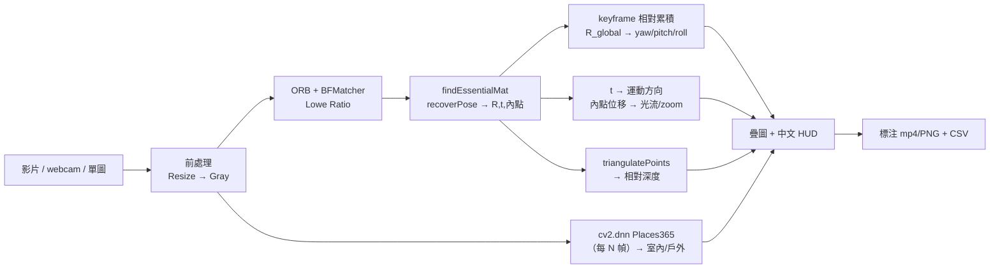
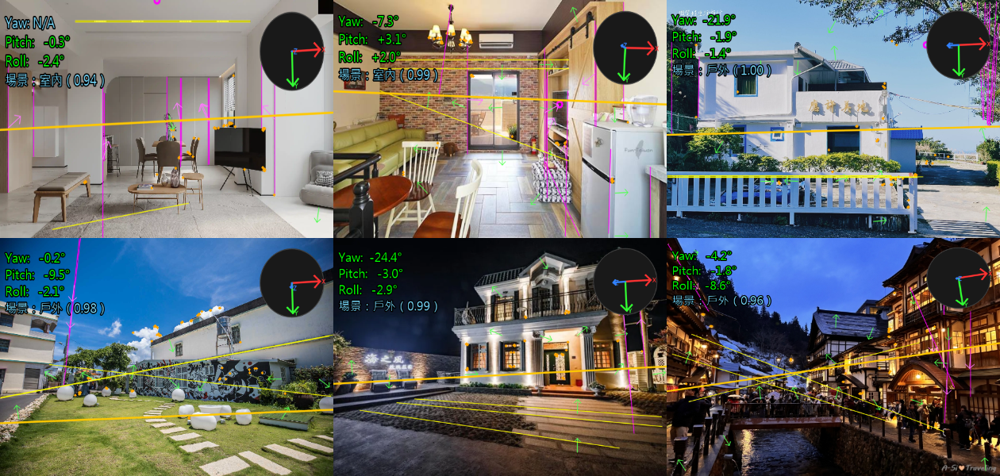
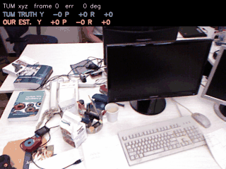
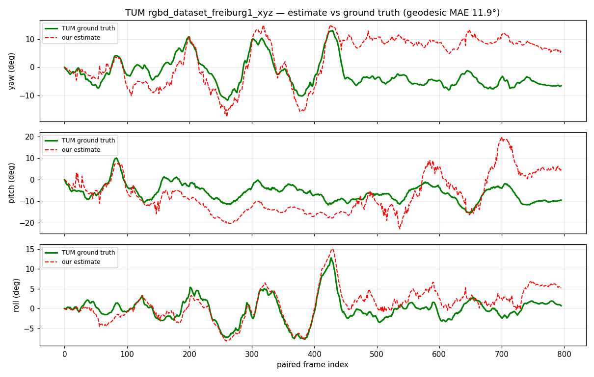
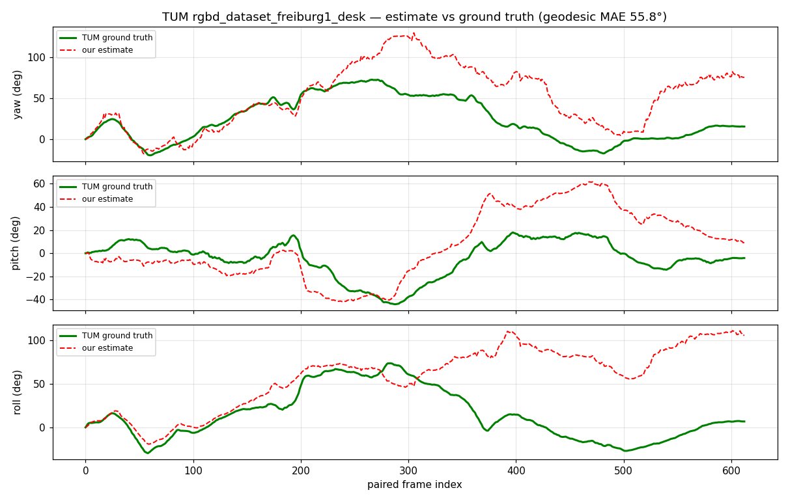
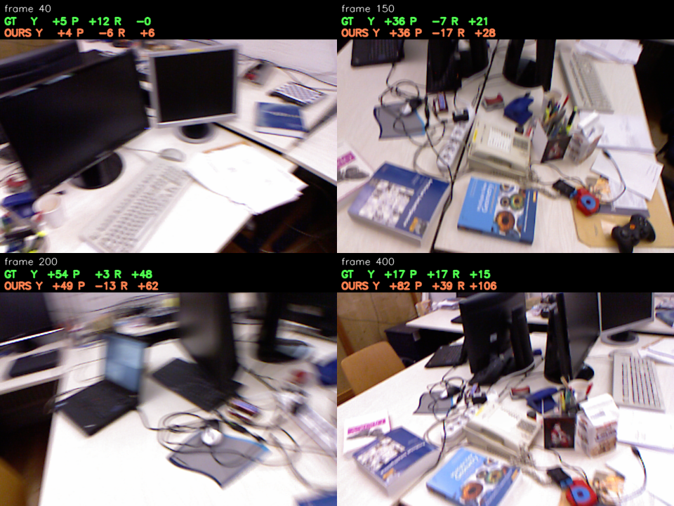

# 相機姿態與場景感知 — Yaw/Pitch/Roll · 室內外 · 動態 · 深度

> 輸入**影片 / 即時攝影機 / 單張圖片**，輸出相機姿態（yaw/pitch/roll）、室內或戶外、
> 動態方向、相對深度與 FPS@解析度。專為 **Raspberry Pi 4B（CPU-only）** 設計，
> 全程以 **OpenCV** 完成（含 `cv2.dnn` 場景分類，推論時不需 PyTorch）。

## 目錄
1. [需求](#1-需求)
2. [系統總覽（What / Why / How）](#2-系統總覽whatwhyhow)
3. [快速開始](#3-快速開始)
4. [設計](#4-設計)
5. [方法說明](#5-方法說明)
6. [驗收（標準答案）](#6-驗收標準答案)
7. [CLI 參數](#7-cli-參數)
8. [Pi 4B 效能與參數調整](#8-pi-4b-效能與參數調整)

---

## 1. 需求

### 功能需求
| 項目 | 說明 |
|------|------|
| 輸入 | 影片 (mp4/avi/mov)、即時攝影機（`0`/`1`…）、單張圖片 (jpg/png…) |
| 姿態輸出 | yaw / pitch / roll（度） |
| 場景輸出 | 室內 / 戶外（indoor / outdoor） |
| 動態方向 | 相機運動方向（t）+ 畫面光流方向 + zoom |
| 深度 | 相對深度分級 NEAR / MID / FAR（尺度相對，非絕對） |
| 效能 | FPS@解析度 |
| 視覺化 | 影片畫光流箭頭、單圖畫水平線/特徵梯度場/消失點 + XYZ 指示器 + 中文 HUD |
| 無頭模式 | `--no-show` 於無螢幕 Pi 上執行 |

### 規格需求
| 項目 | 規格 |
|------|------|
| 目標平台 | Raspberry Pi 4B（ARM Cortex-A72，CPU-only） |
| 解析度 | 預設 640×480（可調） |
| 目標幀率 | 15–25 FPS @ 480p（姿態主迴圈） |
| 依賴 | `opencv-python`、`numpy`、`matplotlib`、`Pillow`（中文 HUD，可選） |
| 語言 | Python 3.10+ |

---

## 2. 系統總覽（What / Why / How）

**What** — 一支管線同時輸出姿態、室內外、動態方向、相對深度與 FPS。

**Why**
- 目標是**嵌入式 Pi 4B**：姿態/動態/深度全用**純 OpenCV 幾何法**，能即時跑。
- 動態方向與深度幾乎**零額外成本**——`recoverPose` 早已算出 `R / t / 內點`，過去被丟棄，現在重用做運動方向與三角化深度。
- 室內/戶外改用 **`cv2.dnn` + Places365**（仍是 OpenCV）：古典啟發式在夜景/雪地/明亮室內失準（3/6），DNN 拉到 **6/6**。

**How**


> **單張圖片**：yaw 需 ≥2 幀（無運動）→ 改用**水平消失點**（結構化場景可觀測，否則 N/A）；roll/pitch 由水平線估計；動態/深度仍需影片（N/A）。

---

## 3. 快速開始

```bash
# 1. 安裝相依套件
pip install -r requirements.txt

# 2.（建議）產生 Places365 模型 → 室內/戶外 3/6 升到 6/6
#    沒有模型也能跑（自動退回古典 HSV 啟發式）
python models/export_places365_onnx.py

# 3. 執行（影片 / 即時攝影機 / 單張圖片）
python src/main.py test_inputs/synthetic3d_pose_test.mp4 --no-show
python src/main.py 0                      # 即時 webcam
python src/main.py test_inputs/test4.jpg  # 單張圖片

# 4. 驗收（與標準答案比對）
python benchmarks/validate_pose.py        # 姿態 vs 合成 GT
python benchmarks/validate_scene.py       # 室內/戶外 vs 標註

# 5. 繪製姿態曲線圖
python plot_poses.py runs/<stem>_pose.csv
```

---

## 4. 設計

### 模組職責
| 模組 | 職責 |
|------|------|
| `src/main.py` | CLI 入口、來源解析（檔案/webcam 整數/圖片） |
| `src/pipeline.py` | 來源路由、幀迴圈、CSV、串接各模組 |
| `src/estimator.py` | ORB + Essential Matrix + **keyframe 相對累積** → yaw/pitch/roll、回傳 R/t/內點 |
| `src/scene.py` | 室內/戶外：`cv2.dnn`+Places365（古典 HSV fallback） |
| `src/motion.py` | `t` → 運動方向；內點位移 → 光流方向 / zoom |
| `src/depth.py` | `triangulatePoints` → 相對深度 + NEAR/MID/FAR |
| `src/orient.py` | 單圖 roll/pitch + 水平線/垂直線/消失點 + 單圖 yaw（VP） |
| `src/draw_cv.py` | 中文 HUD（PIL，無字型退回英文）+ CV 證據繪製 |
| `src/visualize.py` | HUD + XYZ 方向指示器 |
| `benchmarks/` | `metrics` + `validate_pose` / `validate_scene`（驗收） |

完整資料流 / 公式推導見 [`docs/architecture.md`](docs/architecture.md)。

### 輸出格式
**標注影片/圖片**：左上角中文 HUD（偏航/俯仰/側傾/場景/運動/深度）、右上角 XYZ 指示器；影片畫光流箭頭，單圖畫水平線+特徵梯度場+消失點。

**CSV (`runs/<stem>_pose.csv`)** — 15 欄：
```
frame_idx,timestamp_s,yaw_deg,pitch_deg,roll_deg,fps,inliers,nfeatures,
scene,scene_conf,cam_motion,flow_motion,zoom_in,rel_depth,depth_level
```
| 欄位 | 說明 |
|------|------|
| `scene` / `scene_conf` | indoor/outdoor + 信心值 |
| `cam_motion` | FWD/BACK/LEFT/RIGHT/UP/DOWN/STILL（由 `t`） |
| `flow_motion` / `zoom_in` | PAN-L/PAN-R/TILT-U/TILT-D… / 1=推近 |
| `rel_depth` / `depth_level` | 相對深度（baseline 單位，非絕對）+ NEAR/MID/FAR |

> 單圖：`cam_motion/flow_motion/depth_level` 為 `N/A`；`yaw` 結構化場景才有值，否則 `N/A`；另輸出 `runs/<stem>_pose.png`。

---

## 5. 方法說明

| 技術 | WHAT | WHY | HOW |
|------|------|-----|-----|
| **ORB + Essential Matrix** | 從兩幀特徵對應求相對旋轉 | Pi CPU 友善、任意紋理場景皆可 | ORB→BFMatcher(Lowe)→`findEssentialMat`(RANSAC)→`recoverPose`→R,t |
| **keyframe 相對累積** | 把每對旋轉累積成相對第 0 幀的姿態 | 參考幀會持續多幀，直接每幀累乘會**過度累積**（已修正的 bug） | `R_global = R_base @ R`，換參考幀時凍結 `R_base` |
| **室內/戶外（cv2.dnn）** | Places365 ResNet18 場景分類 | 古典啟發式對夜景/雪地/亮室內失準（3/6→DNN 6/6） | `cv2.dnn.readNetFromONNX`→softmax→依官方 IO 表彙總；無模型退回 HSV |
| **單圖 yaw（消失點）** | 結構化場景由水平消失點取 yaw | 單圖無運動拿不到 yaw，但走廊/建築的平行線會收斂 | `vanishing_point` 求交點，x 偏移→`atan2(Δx,f)`；近平行→N/A |
| **動態方向** | 相機運動 + 畫面光流 | 重用既有 `t` 與內點，零額外成本 | `t` 主導軸→方向；內點中位位移→pan/tilt；徑向發散→zoom |
| **相對深度** | 特徵點稀疏三角化 | 重用 R/t/內點，Pi 可承受 | `triangulatePoints(K[I\|0],K[R\|t])`→正 Z 中位數→分級（尺度相對） |

> **為什麼 `cv2.dnn` 不違反「用 OpenCV」**：cv2.dnn 是 OpenCV 內建模組，CPU 載入 ONNX 推論**不需** PyTorch；室內/戶外變化慢，每 ~30 幀跑一次（Pi ~0.6–0.9s/次），姿態主迴圈不受影響。深入見 [`docs/architecture.md`](docs/architecture.md)。

---

## 6. 驗收（標準答案）

每項能力都有標準答案與通過門檻，完整方法書見 [`docs/validation.md`](docs/validation.md)。

| 能力 | 標準答案 | 指標 | 門檻 | 現況 |
|------|---------|------|------|------|
| 姿態 | 合成 3D（精確逐幀 GT，`gen_synthetic3d.py`） | 每軸 MAE | < 15° | ✅ 13.3° |
| 室內/戶外 | 標註檔 / Places365 驗證集 | 準確率 | ≥ 80% | ✅ 100%（6/6） |
| 深度 | NYU/KITTI/DIODE | 尺度對齊 AbsRel / Spearman | ρ ≥ 0.6 | 📋 方法已定 |
| 光流 | MPI Sintel / KITTI flow | EPE / 方向一致率 | < 3px | 📋 方法已定 |

```bash
python benchmarks/validate_pose.py    # 姿態 → 每軸 MAE/RMSE + PASS/FAIL
python benchmarks/validate_scene.py   # 室內/戶外 → 準確率 + PASS/FAIL
```

### 單張圖片實測（6 張測試照片，室內/戶外 6/6）

同一支管線處理**單張照片**，疊上偵測到的 CV 證據與場景判斷：



*圖說：6 張測試照片的標注輸出。左上 HUD 顯示 `Yaw/Pitch/Roll`（單圖由水平線＋消失點估計，無法觀測時標 N/A）與 `場景：室內/戶外（信心值）`；畫面疊上偵測到的**水平線**（黃）、**特徵點＋梯度方向場**（綠）、**垂直線/消失點**（洋紅），右上為 **XYZ 姿態指示器**。分類結果 test1/2＝室內、test3–6＝戶外，與標準答案 **6/6 相符**（對照古典啟發式僅 3/6）。*

> 此驗收框架**第一次跑就抓到一個既有 bug**：姿態旋轉過度累積（合成 GT 上 MAE 飆到 100°），修正為 keyframe 相對累積後降到 13°。詳見 [validation.md](docs/validation.md)。

### 真實世界對比：TUM RGB-D（我們的輸出 vs 動捕真值）

在 [TUM RGB-D](https://cvg.cit.tum.de/data/datasets/rgbd-dataset) 公開測試序列上，用**同一批測試影格**跑我們的系統，和他們的**動作捕捉真值**逐幀對比。

> **圖例**：🟢 綠字 `TUM TRUTH` = TUM 動捕**真值**（他們的標準答案）　🔵 藍字 `OUR EST.` = **我們**系統的估計。

**① 中速序列 `freiburg1_xyz` — 全程貼合真值：**



*圖說：逐幀播放 `freiburg1_xyz`。每格綠字 `TUM TRUTH` 是該幀相機的**真實姿態**、藍字 `OUR EST.` 是**我們的估計**，`err` 為當下旋轉誤差。三軸數值幾乎同步變化——中速序列全程貼合。*

**② 最難序列 `freiburg1_desk`（快速＋動態模糊）— 前段準、後段漂移：**


*圖說：逐幀播放 `freiburg1_desk`（公認最難）。前段藍≈綠，約 200 幀後藍字逐漸偏離綠字、`err` 攀升，呈現單目視覺里程計的**長期漂移**。*

| 序列 | 速度/難度 | yaw | pitch | roll | 幾何旋轉 MAE |
|------|-----------|-----|-------|------|-------------|
| `freiburg1_xyz` | 中速（translation 為主） | 8.0° | 7.1° | **2.0°** | **11.9°** ✅ 全程貼合 |
| `freiburg1_desk` | 快速＋動態模糊（公認最難） | 29.7° | 21.5° | 46.0° | 55.8°（前 7 秒準、後段漂移） |

**三軸對照曲線**（綠實線＝TUM 真值、紅虛線＝我們的估計）：

`freiburg1_xyz`（中速，全程貼合）


*圖說：橫軸＝配對幀序、縱軸＝角度（度），由上而下為 yaw／pitch／roll 三軸。綠實線（TUM 真值）與紅虛線（我們）幾乎重疊，尤其 roll 僅 2° 誤差——代表全程都跟得住真值。*

`freiburg1_desk`（最難，前段準、後段漂移）


*圖說：同樣三軸對幀序。前 ~200 幀紅綠貼合，之後紅線（我們）發散偏離綠線（真值），對應幾何旋轉誤差由數度增至約 110°——這就是快速＋動態模糊序列上的漂移。*

**`freiburg1_desk` 逐幀並排**（真實測試影像 + 🟢TUM 真值 vs 🔵我們的估計）：


*圖說：四個代表幀（frame 40／150／200／400）的單格快照。黑底上排綠字＝TUM 真值、下排藍字＝我們估計的 Y/P/R，可逐格核對數字差距；可見前段接近、frame 400 已明顯偏離。*

> 另有 `freiburg1_xyz` 逐幀並排：[`docs/tum_xyz_frames.png`](docs/tum_xyz_frames.png)

```bash
# 下載並解壓 TUM 序列到 test_inputs/tum/ 後：
python benchmarks/validate_tum.py    --seq test_inputs/tum/rgbd_dataset_freiburg1_xyz --plot docs/tum_xyz_compare.png
python benchmarks/tum_make_gif.py    --seq test_inputs/tum/rgbd_dataset_freiburg1_xyz --out docs/tum_xyz.gif
python benchmarks/tum_frame_compare.py --seq test_inputs/tum/rgbd_dataset_freiburg1_xyz --out docs/tum_xyz_frames.png
```

**結論**：中等速度的真實序列我們**全程貼合真值**（roll 僅 2° 誤差）；只有在最難的快速＋模糊序列才會長期漂移——這是單目 VO（無 SLAM 後端）的本質界線。

---

## 7. CLI 參數
```
python src/main.py <source> [options]

輸出:   --output/-o PATH   --no-show   --no-video
解析度: --imgsz INT（預設 640，0=原始）   --pi-sim（強制 640×480）
演算法: --nfeatures 500   --ratio-thresh 0.75   --ransac-thresh 1.0
        --keyframe-ratio 0.5   --keyframe-inliers 60
校正:   --calib camera_matrix.yaml（由 calibrate.py 產生）
場景:   --scene-model models/places365_resnet18.onnx
        --scene-io    models/io_places365.txt（皆缺→退回 HSV 啟發式）
```

相機校正（選用，精度需 ±1–2° 時）：
```bash
python calibrate.py --images calib_images/ --output my_camera.yaml
python src/main.py video.mp4 --calib my_camera.yaml
```
不校正時以 `fx=fy=W` 近似，旋轉趨勢誤差約 5–10°。

---

## 8. Pi 4B 效能與參數調整

| `--imgsz` | 解析度 | 預估 FPS |
|-----------|--------|---------|
| 320 | 320×240 | 25–35 |
| 480 | 640×480 | 15–25 |
| 720 | 1280×720 | 8–12 |
| 1080 | 1920×1080 | 4–6 |

> 以 `--nfeatures 500 --no-video` 為基準；室內/戶外每 ~30 幀跑一次，對 FPS 影響可忽略。

| 問題 | 調整方式 |
|------|---------|
| 特徵/內點太少、姿態跳動 | 提高 `--nfeatures`、放寬 `--ratio-thresh` |
| 姿態漂移過大 | 調低 `--keyframe-ratio`/`--keyframe-inliers`（更常換參考幀） |
| Pi 太慢 | 降 `--imgsz`（如 320）、`--no-video` |
| 室內/戶外不準 | 確認已產生 Places365 模型（否則退回較弱的啟發式） |
| 單圖 yaw 常 N/A | 正常——僅結構化（建築/走廊/街道）場景才可觀測 |
